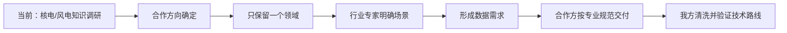

# Energy DataForge

面向核电或风电领域的大模型数据准备项目。

当前尚未签订合作合同，合作方向和具体场景也未确定，因此仓库暂时保留核电、风电两套调研资料。合作确定后，本项目只保留最终选择的一个领域，不计划同时建设两个领域的产品。

## 当前目标

- 让从事大模型工作的团队快速理解候选行业。
- 理解行业知识、业务数据与 RAG、微调、专属模型之间的关系。
- 为后续与行业专家讨论具体场景建立共同语言。
- 场景确定后，能够写清楚需要什么数据和如何交付。

当前不采集、不清洗、不训练任何外部数据，也不规定合作方内部的数据管理和清洗流程。

## 阅读入口

### 核电候选方向

1. [核电大模型项目入门](docs/nuclear/nuclear-primer.md)
2. [核电术语速查](docs/nuclear/nuclear-glossary.md)
3. [核电公开来源规划](docs/nuclear/nuclear-source-plan.md)

### 风电候选方向

1. [风电大模型项目入门](docs/wind/wind-primer.md)
2. [风电术语速查](docs/wind/wind-glossary.md)
3. [风电公开来源规划](docs/wind/wind-source-plan.md)

### 公共思路

1. [核电与风电 AI 合作及落地情况调研](docs/common/nuclear-wind-ai-application-research.md)
2. [核电与风电数据情况调研](docs/common/nuclear-wind-data-research.md)
3. [RAG、微调和专属模型判断](docs/common/model-routing-guide.md)

## 场景确定后的两份材料

- [数据需求说明](templates/data-requirement.md)：我方根据明确场景说明需要什么数据。
- [数据交付说明](templates/data-delivery.md)：双方记录实际交付内容，不限制合作方使用何种内部规范。

## 后续项目形态

## 当前不做

- 不爬取或下载行业数据。
- 不预先定义目录、逐条 JSON Schema 或统一数据模板。
- 不设计合作方的数据治理、权限和接入流程。
- 不设计验收报告和复杂审批模板。
- 不在场景和真实数据出现前确定模型、数据库或向量库。
