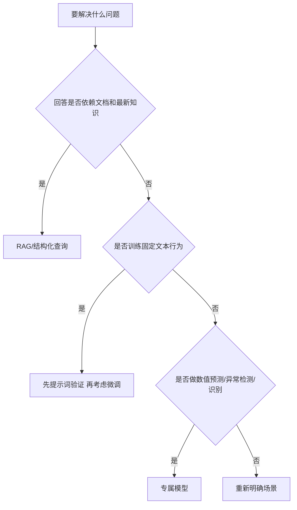
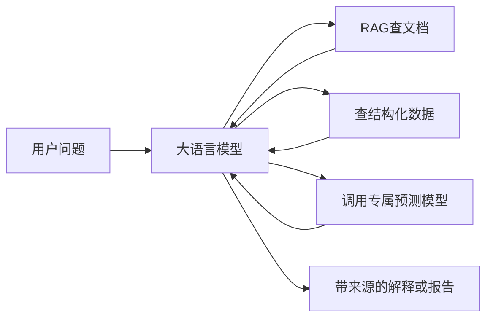

# RAG、微调和专属模型的简单判断

## 1. 先看问题，不先看数据

## 2. RAG

适合：

- 法规、标准、手册、报告和知识库问答。
- 内容会更新。
- 回答需要来源和页码。
- 希望数据更新后立即生效。

需要的数据：

- 原始文档。
- 文档名称、版本和日期。
- 文件分类。
- 设备或业务对象与文档的关系。

## 3. 微调

适合：

- 固定的分类方式。
- 统一的抽取格式。
- 统一报告表达。
- 稳定的问答或拒答行为。

需要的数据：

- 大量相对一致的输入和正确输出。
- 明确的标注规则。
- 人工确认的示例。

原始文档通常先做 RAG，不因为“专业”就直接微调。

## 4. 专属模型

适合：

- 风功率预测。
- 设备异常检测。
- 故障分类。
- 状态趋势和剩余寿命。
- 图像或信号识别。

需要的数据：

- 连续的表格、时序、图像或信号。
- 时间、设备和工况。
- 故障、维修或目标值。
- 足够的正常和异常样本。

## 5. 常见组合

例如风机异常分析可能同时使用：

- 专属模型从 SCADA 判断异常。
- RAG 查找对应告警说明和检修手册。
- 大语言模型把结果组织成可读报告。

## 6. 当前阶段怎么处理

场景未确定时，只把下面几项作为调研时的初步方向：

- `RAG 候选`
- `微调候选`
- `专属模型候选`
- `组合候选`
- `暂时无法判断`

合作明确场景后，将初步方向写入[数据需求说明](../../templates/data-requirement.md)。看到真实样本并跑过基础方案后，再做正式选择。
