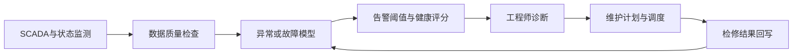
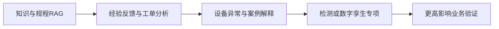

# 核电与风电 AI 合作及落地情况调研

> 文档性质：合作前行业调研与项目方向判断  
> 适用读者：大模型、数据和项目人员，以及后续参与沟通的行业专家  
> 调研范围：核裂变发电与陆上、海上风电；不讨论核聚变  
> 资料范围：监管机构、政府部门、能源企业、国家实验室及行业技术机构公开资料

## 1. 调研目的

本报告回答四个问题：

1. AI 当前在核电和风电行业已经做到了什么程度。
2. 行业内常见的合作方式和真实落地形态是什么。
3. 如果开展大模型或行业模型项目，可以优先做哪些事情。
4. 不同场景需要什么数据，适合 RAG、微调还是专属模型。

本报告不是产品立项书，也不预设未来合作方一定属于核电或风电。当前合作尚未签订、场景尚未确定，因此报告用于：

- 形成内部共同认识。
- 支撑前期方案汇报。
- 帮助团队与行业专家讨论场景。
- 在合作方向明确后快速收敛项目范围。

## 2. 阅读结论

### 2.1 一句话结论

核电 AI 已经在知识检索、经验反馈、无损检测、巡检和设备状态分析等辅助环节落地，但涉及安全重要控制、自动决策和自主运行时仍处于严格验证或监管研究阶段；风电 AI 在功率预测、故障预警、预测性维护和图像巡检方面的产业化程度更高，数据驱动模型已成为智慧风场的重要组成部分。

### 2.2 核电结论

- 当前最常见的落地不是“AI 控制核电站”，而是 AI 辅助人员查资料、分析事件、检查图像、识别异常和制定检修建议。
- 生成式 AI 主要进入知识问答、文件处理、经验反馈、工程设计和许可材料辅助环节。
- 时序机器学习、计算机视觉和数字孪生比通用大模型更早进入生产业务。
- 核安全要求决定了模型必须有明确边界、人工复核、来源追溯和独立验证。
- 直接控制反应堆、安全保护定值调整、自动执行应急操作等场景，不适合作为本项目第一阶段目标。

### 2.3 风电结论

- 风电的成熟 AI 场景主要是功率预测、设备异常检测、预测性维护、叶片缺陷识别和运维优化。
- 风电已经形成“气象数据 + SCADA + 告警 + 检修记录 + 图像”的多模态应用结构。
- 大模型适合处理规程、手册、工单、故障案例和运维问答；功率预测和故障预警仍应由时序模型、机器学习或机理融合模型承担。
- 与核电相比，风电更容易以单场站或单类设备进行试点，也更容易用发电量、可利用率、预警提前量和检修成本衡量效果。
- 海上风电对远程运维、无人机和机器人需求更强，但其数据、作业和硬件集成复杂度也更高。

### 2.4 两个行业的共同规律

1. 先解决具体业务问题，再决定是否使用大模型。
2. 企业内部数据和专家经验比公开行业知识更能决定模型价值。
3. RAG、微调和专属模型不是互斥关系，而是不同数据和任务的组合。
4. 高价值模型通常需要真实运行数据、正确时间关联和专家确认，公开资料只能完成入门、原型或基础知识能力。
5. 模型输出先用于提示、排序、解释和辅助决策，再逐步进入闭环业务。

## 3. 本报告如何判断“已经落地”

企业新闻中常同时出现“发布、试点、投用、规模应用、规划建设”等表达。为避免将概念展示当成生产应用，本报告采用以下分层：

| 层级        | 判断标准                               | 本报告中的含义                               |
| ----------- | -------------------------------------- | -------------------------------------------- |
| L1 研究验证 | 实验室、仿真环境或研究项目已验证可行性 | 技术可能可用，但不能说明能在生产环境稳定运行 |
| L2 现场试点 | 使用真实设备或真实业务数据开展试点     | 已接近业务，但范围、周期和泛化能力仍有限     |
| L3 生产应用 | 已在一个或多个真实业务环境持续使用     | 已形成生产能力，但可能仍需要大量人工复核     |
| L4 规模推广 | 已跨机组、场站或企业复制               | 具备较成熟的产品和实施方法                   |
| L5 自主闭环 | AI 可直接形成并执行生产控制决策        | 核电安全重要系统中目前不宜作为普遍现状理解   |

以下案例的层级是根据公开材料进行的保守判断，不等同于对产品进行技术验收。

还需要注意：

- 企业披露的准确率、节省金额和效率提升属于企业或项目方口径。
- 除非资料明确说明，本报告不将这些指标视为第三方独立验证结果。
- “使用 DeepSeek、大模型或智能体”不能单独证明业务有效，仍需看数据、流程和使用结果。

## 4. 核电 AI 合作与落地情况

### 4.1 国内发展状态

国内核电 AI 正从单点工具向平台化和多场景协同发展，已经公开的方向包括：

- 核电知识问答和经验反馈。
- 质量事件分析与原因追溯。
- 焊缝、射线底片等无损检测。
- 机器人巡检与智能监测。
- 设备故障预警和远程诊断。
- 工程建设、设计和运维文件处理。
- 辐射防护、备件、交通和现场管理。

同时，国家核安全监管部门已开始系统研究 AI 应用的监管政策，说明行业正在从“企业探索”进入“应用与监管并行”的阶段。

#### 4.1.1 代表性案例

| 参与方                 | 应用内容                          | 公开进展                                                   | 保守判断 | 对本项目的启示                                         |
| ---------------------- | --------------------------------- | ---------------------------------------------------------- | -------- | ------------------------------------------------------ |
| 国家核安全局及相关单位 | 核工业 AI 应用及安全监管政策研究  | 2025 年召开工作组会议，研究监管技术政策                    | 监管准备 | 核电 AI 不能只讨论模型效果，必须考虑适用边界和监管证据 |
| 中核集团相关单位       | 核电建设质量经验反馈平台          | 大模型、知识图谱和智能体辅助根因分析、故障树分析及经验反馈 | L2-L3    | 事件报告、原因、措施和反馈结果是高价值数据             |
| 中国广核集团           | DeepSeek 本地化部署和核电知识应用 | 披露多个数据集和应用，覆盖知识、分析及专业业务             | L2-L3    | 核电生成式 AI 以私有化部署和专业知识增强为主           |
| 中国广核集团           | 射线底片、焊缝等质量检测          | AI 辅助识别核电建设和在役检查图像                          | L3       | 图像模型与专业复核结合，比纯文本大模型更接近生产价值   |
| 中国广核集团           | 巡检机器人及 5G 专网              | 机器人在核电现场开展巡检和数据采集                         | L3       | AI 项目可能需要与机器人、网络和业务系统集成            |
| 中国广核集团           | 新一代智能仪控产品 iNICS          | 融合数字孪生、故障预警、智能监测和决策支持                 | L2-L3    | “智能仪控”不等同于大模型直接承担安全控制               |
| 上海核工院等单位       | 核电远程智能诊断                  | 远程汇聚运行信息，支持设备诊断和专家分析                   | L2-L3    | 跨系统数据关联和专家参与是设备智能的基础               |

#### 4.1.2 国内案例说明

##### 质量经验反馈

核电建设和运行会积累偏差、缺陷、不符合项、事件报告、原因分析和纠正措施。公开案例显示，大模型可以与知识图谱、故障树和 8D 分析方法结合，用于：

- 从历史案例中寻找相似事件。
- 提取事件对象、原因、措施和结果。
- 辅助构建原因链。
- 推荐需要参考的标准或历史处置。
- 将新事件转为可复用的经验。

这类场景适合首先使用 RAG，再根据专家确认过的高质量问答、分类和分析样本决定是否微调。模型不应自行给出最终质量结论。

参考：[国家核安全局——我国首个核电建设质量经验反馈数智化平台正式发布](https://nnsa.mee.gov.cn/ztzl/haqshmhsh/haqrdmyyt/202502/202502/t20250228_1103067.html)

##### 无损检测与智能巡检

核电无损检测常涉及射线底片、超声、涡流和表面图像。AI 的价值主要是：

- 标出疑似缺陷位置。
- 对缺陷进行初步分类。
- 按风险或置信度排序。
- 减少检测人员重复查看正常样本的工作量。
- 保留图像、模型结果和人工结论之间的对应关系。

公开材料已经出现批量射线底片辅助检测和机器人巡检案例。这类能力通常由计算机视觉或信号模型承担，大模型更适合解释检测结论、关联规程和生成初稿。

参考：

- [国家核安全局——“华龙一号”批量化建设核安全管理数字化智能化应用](https://nnsa.mee.gov.cn/ztzl/haqshmhsh/haqrdmyyt/202603/202603/t20260323_1147455.html)
- [中国广核集团——核电人工智能应用及焊缝底片识别](https://www.cgnpc.com.cn/cgn/c100944/2026-03/12/content_396c9631de6e41de8979c743b8f0a4bb.shtml)
- [中国广核集团——智能巡检机器人投入核电现场应用](https://www.cgnpc.com.cn/cgn/c100944/2026-05/22/content_ffb718392fe845dfb5a5ae92526c105d.shtml)

##### 平台化 AI

部分企业开始建设统一 AI 平台，将能力用于备品备件、辐射防护、运输、经验反馈、故障预警和工单等多个场景。这表明：

- 企业更倾向建设共用模型和数据能力，而不是每个部门重新建设。
- 真正落地仍然依赖每个场景的专业数据和评测。
- 通用大模型是交互和知识入口，不能替代所有专业算法。

参考：[中国广核集团——人工智能技术在核电多场景中的应用](https://www.cgnpc.com.cn/cgn/c100944/2025-03/03/content_bdcfa1c5ddad45a58075b85e8b6a45fc.shtml)

##### 监管同步推进

核电 AI 的重要特征是监管机构会关注：

- 模型用于什么系统和什么功能。
- 是否改变原有安全功能。
- 输出是否可解释、可验证、可追溯。
- 人员是否仍保有判断和控制能力。
- 数据、网络和软件变更是否受控。

国家核安全局已组织 AI 应用及安全监管研究；核能行业提出的相关倡议也强调安全优先、试点验证和成熟后部署。

参考：

- [国家核安全局——核工业人工智能应用及安全监管研究工作组第一次会议](https://nnsa.mee.gov.cn/ywdt/gzdt/202510/t20251029_1130950.html)
- [国家核安全局——“人工智能+”核能高质量发展倡议](https://nnsa.mee.gov.cn/ywdt/hyzx/202511/t20251125_1134753.html)

### 4.2 国际发展状态

国际核电 AI 的公开落地同样主要集中在辅助业务，而不是由 AI 独立承担核安全责任。

#### 4.2.1 代表性案例

| 参与方                                                   | 应用内容                               | 公开进展                                       | 保守判断 | 对本项目的启示                                       |
| -------------------------------------------------------- | -------------------------------------- | ---------------------------------------------- | -------- | ---------------------------------------------------- |
| Constellation、Blue Wave AI Labs、美国能源部及国家实验室 | 传感器校准异常识别、堆芯测量和燃料优化 | 工具已在两座核电站部署，并计划扩大使用         | L3       | 时序数据和物理约束结合可以形成直接经营价值           |
| EDF、Mistral AI                                          | 工程、维护、EPR2 建设和技术记忆智能体  | 签订五年合作，在主权云和 EDF 数据中心部署      | L2-L3    | 企业数据所有权、本地环境和技术记忆是合作重点         |
| EDF Metroscope                                           | 数字孪生和故障诊断                     | 用于核电及火电设备状态分析                     | L3       | 机理模型与 AI 结合适合复杂能源设备                   |
| Framatome                                                | 无损检测 AI                            | 深度学习进入视觉、涡流和超声检查流程           | L3       | 专业检测模型需要经过流程和人员资质体系验证           |
| Idaho National Laboratory、Microsoft                     | 核许可工程和安全报告辅助               | 合作开发 AI 辅助文档生成与审查能力             | L1-L2    | 许可文本可以用生成式 AI 提效，但必须保持证据和审查链 |
| Idaho National Laboratory、AWS                           | 设计、许可、建设、运行及自主化研究     | 建立云与 AI 合作                               | L1-L2    | 云平台、仿真和 AI 正形成研发基础设施                 |
| OECD 核能署 RegLab 及多国监管机构                        | 核电实时异常检测监管沙盒               | 对解释性、数据保证、审计和纵深防御开展联合研究 | 监管验证 | 模型解释不能代替数据和系统级安全论证                 |
| 美国 ARPA-E、国家实验室及企业                            | 数字孪生、自动化与先进堆自主运行       | 多个研究计划持续推进                           | L1-L2    | 自主运行属于长期方向，不适合作为一般项目的近期承诺   |

#### 4.2.2 重要案例说明

##### 传感器异常和燃料优化

美国能源部公开资料显示，Blue Wave AI Labs 的机器学习工具已经在 Constellation 运营的两座核电站部署。工具分析大量历史电站数据，用于：

- 识别可能失准的堆芯传感器。
- 提高对运行状态的可见性。
- 支持燃料采购和堆芯配置分析。
- 在保持运行限值裕量的条件下降低损失。

该案例说明，核电 AI 可以进入高价值技术环节，但其落地依赖历史运行数据、传统工程方法、操作人员判断和许可证要求，并非模型独立控制。

参考：[美国能源部——New AI Tools Could Save Constellation Reactor Fleet Millions](https://www.energy.gov/ne/articles/new-ai-tools-could-save-constellation-reactor-fleet-millions)

##### 核电工程知识和主权部署

EDF 与 Mistral AI 的五年合作覆盖工程、维护、EPR2 建设和技术记忆智能体。公开信息特别强调：

- EDF 保持数据所有权。
- 能力部署在主权云或 EDF 数据中心。
- 合作目标是辅助工程和知识工作。
- 不将大模型描述为核电控制系统。

这与核电行业的普遍路径一致：先用大模型处理知识和工程工作，再在受控范围内扩大用途。

参考：[EDF——EDF and Mistral sign a partnership agreement for AI serving nuclear power](https://www.edf.fr/en/the-edf-group/dedicated-sections/journalists/all-press-releases/edf-and-mistral-sign-a-partnership-agreement-for-ai-serving-nuclear-power-and-digital-sovereignty)

##### AI 部署仍处于早期阶段

国际原子能机构 2025 年报告将核电 AI 描述为仍处于早期采用阶段，实际应用主要是试点或有限部署。报告讨论的方向包括：

- 维护和设备诊断。
- 告警与信号验证。
- 应急响应辅助。
- 人机界面。
- 培训。
- 控制相关研究。

报告同时强调数据相关性、质量、代表性，以及人类角色不能被模糊处理。

参考：[IAEA——Considerations for Deploying Artificial Intelligence Applications in the Nuclear Power Industry](https://www-pub.iaea.org/MTCD/Publications/PDF/p15866-PUB2119_web.pdf)

##### 监管沙盒

OECD 核能署组织的国际监管实验室项目，以实时异常检测为对象开展跨国监管研究。其公开结论表明：

- 解释模型结果很重要，但解释性本身不足以证明安全。
- 还需要可审计的推理链、数据保证和纵深防御。
- 监管者需要在实际应用前形成评估能力。

参考：[OECD Nuclear Energy Agency——International RegLab project reports on AI use in nuclear power plant operations](https://oecd-nea.org/jcms/pl_117030/international-reglab-project-reports-on-ai-use-in-nuclear-power-plant-operations)

### 4.3 核电 AI 的成熟度判断

#### 已具备生产落地基础

- 行业知识库、规程检索和带来源问答。
- 经验反馈、事件归纳和相似案例检索。
- 工程文件抽取、比对和初稿生成。
- 焊缝、底片和表面图像辅助检测。
- 巡检机器人采集与异常提示。
- 非安全级设备状态监测和故障预警。

#### 正在扩大试点

- 电站级异常检测。
- 预测性维护。
- 数字孪生和故障根因排序。
- 核许可文件辅助编制和审查。
- 多源告警归并和运行支持。
- 培训模拟和岗位辅助。

#### 仍以研究和监管准备为主

- AI 直接控制反应堆。
- AI 自动改变安全保护定值。
- 无人工复核的应急决策和执行。
- 高度自主化或无人核电站运行。
- 用生成式模型替代持证操纵员或核安全审评人员。

### 4.4 核电可以优先做什么

#### 优先级 A：知识与文件辅助

可做内容：

- 规程、标准、手册、设计文件和历史报告问答。
- 条款定位、版本对比和关联引用。
- 文件要点提取、术语解释和报告初稿。
- 根据岗位和任务提供受限知识入口。

适合路线：

- RAG 为主。
- 有稳定表达风格、分类或抽取任务时再做小规模微调。
- 所有关键答案显示原文位置、版本和适用范围。

#### 优先级 A：经验反馈与事件分析

可做内容：

- 相似事件检索。
- 设备、现象、原因、措施和结果抽取。
- 原因分析框架辅助。
- 纠正措施关联和经验反馈草稿。

适合路线：

- RAG + 结构化检索。
- 专家确认样本足够后，可微调分类、抽取或报告生成能力。
- 最终原因和措施由专业人员确认。

#### 优先级 A：检修工单和缺陷辅助

可做内容：

- 工单归类和描述规范化。
- 缺陷与设备、告警、检修历史关联。
- 推荐排查顺序和参考案例。
- 检修后结果归纳。

适合路线：

- 文本部分使用 RAG 或微调。
- 与时序数据结合时使用专属诊断模型。

#### 优先级 B：设备异常和预测性维护

可做内容：

- 传感器漂移和信号异常识别。
- 关键设备健康状态评估。
- 多参数异常模式发现。
- 预警后自动关联规程、历史缺陷和检修案例。

适合路线：

- 时序机器学习、异常检测或机理融合模型为核心。
- 大模型负责解释、交互和证据汇总。
- 需要连续历史数据、检修时间和真实故障结果。

#### 优先级 B：无损检测

可做内容：

- 射线底片、表面图像、超声或涡流信号辅助识别。
- 疑似缺陷排序和复核工作量分配。
- 检测结果与历史案例、标准条款关联。

适合路线：

- 计算机视觉或信号模型为核心。
- 大模型不能代替有资质的检测人员签发结论。

#### 不建议作为首期项目

- 直接控制反应堆。
- 自动执行安全重要操作。
- 自动审批核安全结论。
- 无依据生成操作规程。
- 以聊天机器人替代正式运行、质量或安全流程。

## 5. 风电 AI 合作与落地情况

### 5.1 国内发展状态

国内风电已经从单点预测和故障模型，逐步发展为覆盖“气象—发电—设备—检修—交易”的智慧运营体系。主要应用包括：

- 风速、气象和功率预测。
- 设备故障预警与预测性维护。
- 无人机叶片巡检与缺陷识别。
- 场站机器人和远程集控。
- 运维工单和备件优化。
- 电力交易和调度辅助。
- 新能源行业大模型及知识助手。

#### 5.1.1 代表性案例

| 参与方                 | 应用内容                         | 公开进展                                                         | 保守判断              | 对本项目的启示                                     |
| ---------------------- | -------------------------------- | ---------------------------------------------------------------- | --------------------- | -------------------------------------------------- |
| 国家能源集团国华投资   | 运行状态风机叶片无人机自动巡检   | 在多个新能源场站规模应用，深度学习识别腐蚀、胶衣脱落和雷击等缺陷 | L4                    | 图像采集、缺陷标签和人工复核可形成清晰闭环         |
| 国家能源集团龙源电力   | 无人机叶片巡检和图像分析         | 在多地开展自动巡检与智能识别                                     | L3-L4                 | 单机巡检时间和缺陷检出可直接衡量                   |
| 国家能源集团龙源电力   | 多机器人、数字孪生和智能运维     | 在风场建设多机器人协同示范                                       | L2-L3                 | 海量设备和偏远场站推动无人化运维                   |
| 中国华能集团           | 风机预测性维护                   | 打通数据治理、故障诊断、阈值、维护决策和调度链路                 | L3-L4                 | 价值不在单个模型，而在预警如何进入维修计划         |
| 国家能源局相关示范     | 全国新能源功率预测平台           | 支持自动训练和在线更新，服务新能源预测                           | L3-L4                 | 功率预测需要气象、场站和持续更新机制               |
| 国家能源集团           | “擎源”电力行业大模型             | 面向风电、火电等能源场景提供预测维护、交易和调度能力             | L2-L3                 | 行业大模型更像共用能力平台，具体价值仍落在场景应用 |
| 金风科技               | 功率预测、设备健康和智慧运维平台 | 形成面向大量场站的服务产品                                       | L4                    | 设备厂商和服务商拥有跨场站数据优势                 |
| 金风科技、香港科技大学 | AI 气象和新能源联合研究          | 开展高分辨率数值天气预报、极端天气和功率预测研究                 | L1-L2                 | 气象基础模型将影响功率预测、资源评估和运维         |
| 远景能源               | 物理 AI、数字孪生和风机智能控制  | 公开形成多类模型和智能风机产品体系                               | L2-L4，视具体功能而定 | “智能控制”需要区分产品能力、现场验证和可复制效果   |

#### 5.1.2 国内案例说明

##### 叶片无人机巡检

国家能源集团公开资料显示，国华投资的运行状态叶片巡检系统将无人机航迹规划、激光雷达测距、飞行控制和深度学习识别结合，在风机不停机状态下采集叶片多角度图像，并识别腐蚀、胶衣脱落和雷击等缺陷。

企业披露该技术已在多个新能源场站规模应用，叶片巡检时间缩短 50% 以上，缺陷识别准确率达到 90% 以上。上述数字属于企业公开口径，但可以确认的更重要事实是：这类系统已经从研究进入场站应用。

参考：

- [国家能源集团——国华投资运行状态风电机组叶片自动巡检系统](https://www.ceic.com/gjnyjtww/newCE0302/202510/8d2bc77d985e413daef63ebbbfb31b92.shtml)
- [国家能源集团——龙源电力无人机叶片智能巡检](https://epaper.ceic.com/pc/content/202603/23/content_20833.html)

##### 预测性维护

风机包含齿轮箱、发电机、主轴、变桨、偏航、变流器等多个系统。预测性维护通常不是“预测准确就结束”，而是一个完整流程：

中国华能公开的相关实践覆盖多个系统和故障类型，并将模型输出连接到维护决策和调度。这说明可落地的项目要回答：

- 提前多久发出预警。
- 预警对应什么部件和故障。
- 是否减少漏报、误报和非计划停机。
- 维护人员如何确认并采取行动。
- 检修结果能否回到模型中。

参考：[中国华能集团——风电设备预测性维护相关实践](https://www.chng.com.cn/detail_jtyw/-/article/ccgb60va5Gwc/v/1318904.html)

##### 功率预测

风电功率预测将气象预报、实测风速、机组状态、限电情况和历史功率结合，用于：

- 发电计划。
- 电网调度。
- 电力交易。
- 场站运营。
- 储能协同。

国家能源局公开的新能源功率预测平台成果包含自动建模和在线更新能力。与文本大模型不同，功率预测的核心是数值天气预报、时间序列、空间关系和机组功率特性。

参考：

- [国家能源局——新能源功率预测相关技术成果](https://www.nea.gov.cn/2024-01/30/c_1310762738.htm)
- [国家能源局——人工智能在新能源领域的预期应用场景](https://obor.nea.gov.cn/detail2/22235.html)

##### 行业大模型

国家能源集团发布的“擎源”电力行业大模型覆盖新能源预测维护、交易辅助和调度等方向；金风科技、远景能源等企业也在建设面向风电的 AI 能力。

这类平台需要拆成三部分理解：

1. 大模型处理知识、语言和人机交互。
2. 专业算法处理功率、设备时序和图像。
3. 业务系统负责告警、工单、排班、交易或控制。

如果只部署大模型而没有专业算法和业务闭环，就难以形成风电生产价值。

参考：

- [国家能源局——国家能源集团“擎源”电力行业大模型](https://www.nea.gov.cn/20250704/e246d82887404c18a30c385931fd68c6/c.html)
- [金风科技——智慧运维服务](https://www.goldwind.com/cn/service/operation/)
- [远景能源——AI Wind Turbine](https://www.envision-group.com/wind-turbine)

### 5.2 国际发展状态

国际风电 AI 与国内方向基本一致，海上风电更加重视数字孪生、远程运维、机器人和自主作业。

#### 5.2.1 代表性案例

| 参与方                               | 应用内容                              | 公开进展                                       | 保守判断          | 对本项目的启示                                     |
| ------------------------------------ | ------------------------------------- | ---------------------------------------------- | ----------------- | -------------------------------------------------- |
| ORE Catapult、Adatwin                | 基于真实海上风机 SCADA 的 AI 数字孪生 | 使用一年真实数据完成模型验证，为商业试点做准备 | L2                | 高质量真实数据和运维专家解释是产品成熟的关键       |
| ORE Catapult、Cognitive Wind AI、RWE | 实时性能监测和预测性维护              | 与运营商合作推动商业化                         | L2-L3             | 模型需要进入运营商现场验证，而非只在历史数据上评测 |
| ORE Catapult、Firefly Inspect        | 无人机和红外图像检测                  | 在风机检查场景开展现场试验                     | L2                | 多光谱图像可以补充可见光缺陷识别                   |
| ORE Catapult、4Ax Technologies       | 叶片内部机器人检查                    | 使用机器人和 AI 进行叶片内部缺陷检测验证       | L1-L2             | 内部叶片检查具有价值，但硬件环境复杂               |
| ORE Catapult、MIMRee 项目伙伴        | 海上风机自主检查和维修机器人          | 完成多技术集成和示范                           | L2                | 海上场景驱动“检测—定位—维修”一体化                 |
| ORE Catapult、BladeBUG、EchoBolt、GE | 叶片螺栓自主检查机器人                | 完成样机和示范                                 | L2                | AI 可能与专用机器人共同交付，而不是单独的软件项目  |
| 美国能源部、NREL                     | 风资源、功率预测、运维和生态监测研究  | 建设 WIND Toolkit 并持续开展 AI/ML 研究        | L1-L4，因应用而异 | 开放数据适合算法研究，真实运营落地仍需企业数据     |

#### 5.2.2 重要案例说明

##### 基于真实 SCADA 的数字孪生

2026 年公开的 Adatwin 案例使用 ORE Catapult 示范风机一年的 SCADA、气象塔和变电站数据，研究风机运行规律，以及叶片、偏航和发电机的健康状态。ORE Catapult 同时提供：

- 计划与非计划维护流程解释。
- 海上人员到达和作业约束。
- 故障演化和 P-F 曲线知识。
- 部件更换与发电损失背景。

项目形成异常检测和部件健康能力，并为后续商业试点做准备。该案例说明，仅有 SCADA 文件不够，模型团队还必须理解维护流程和故障事件。

参考：[ORE Catapult——Adatwin AI-powered digital twin](https://ore.catapult.org.uk/resource-hub/case-studies/adatwin)

##### 智能运维商业化

ORE Catapult、Cognitive Wind AI 和 RWE 的合作将实时性能监测、故障发现和预测性维护用于风场运营验证。其商业逻辑是：

- 更早发现性能偏差。
- 减少不必要的现场检查。
- 降低纠正性维护。
- 提高可利用率和发电量。

项目方披露了性能误差和维护成本方面的预期，但这些指标仍应在具体场站按统一基线重新验证。

参考：[ORE Catapult——Smart O&M solution for wind turbine performance monitoring](https://ore.catapult.org.uk/media-centre/press-releases/smart-om-solution-revolutionise-wind-turbine-performance-monitoring)

##### 机器人和自主作业

海上风机距离陆地远、人员运输成本高、天气窗口有限，因此行业正在研究：

- 无人机外部叶片检查。
- 叶片内部爬行机器人。
- 螺栓和结构件自动检查。
- 机器人完成简单维修。
- 多机器人远程协同。

这些项目中 AI 通常承担识别、定位、路径规划和状态判断，机器人负责采集和作业。其交付难度高于纯软件项目。

参考：

- [ORE Catapult——Firefly Inspect 无人机红外检查](https://ore.catapult.org.uk/press-releases/aefirefliesaeinfrared-vision-set-transform-wind-turbine-aircraft-inspections)
- [ORE Catapult——4Ax 叶片内部检查](https://ore.catapult.org.uk/resource-hub/case-studies/4ax-technologies)
- [ORE Catapult——MIMRee 自主检查与维修](https://ore.catapult.org.uk/resource-hub/projects/mimree)
- [ORE Catapult——BladeBUG 螺栓检查机器人](https://ore.catapult.org.uk/media-centre/press-releases/meet-the-robot-that-can-help-wind-industry-solve-critical-maintenance-issue)

### 5.3 风电 AI 的成熟度判断

#### 已具备规模应用基础

- 超短期、短期和中期功率预测。
- SCADA 异常检测。
- 部分关键部件故障预警。
- 无人机叶片图像采集与缺陷辅助识别。
- 远程监控和集中运维。
- 设备健康评分和检修辅助。

#### 正在扩大试点

- 跨场站预测性维护平台。
- 海上风电数字孪生。
- 多机器人协同巡检。
- AI 气象基础模型。
- 电力交易与运维联合优化。
- 生成式 AI 运维助手和自动工单分析。

#### 仍需进一步验证

- 无人值守条件下的复杂故障全自动处置。
- 完全由 AI 决定并执行重大设备控制策略。
- 无人工审核的海上机器人维修。
- 跨机型、跨气候区域无需适配的通用故障模型。
- 只依靠大模型完成数值预测和设备诊断。

### 5.4 风电可以优先做什么

#### 优先级 A：运维知识和工单助手

可做内容：

- 手册、故障代码、规程和检修案例问答。
- 告警解释和排查步骤定位。
- 工单归类、摘要和历史相似工单检索。
- 检修报告初稿和备件信息关联。

适合路线：

- RAG 为主。
- 有大量确认过的工单分类、故障归因或规范表达样本后再微调。
- 可以较快做出演示，但真实价值依赖企业内部资料。

#### 优先级 A：功率预测

可做内容：

- 单机、场站或区域级功率预测。
- 极端天气和爬坡事件预测。
- 预测偏差分析。
- 限电、停机和异常数据识别。

适合路线：

- 时序模型、机器学习、数值天气预报后处理或机理融合模型。
- 大模型用于解释预测变化和查询相关运营信息。
- 需要连续气象、功率、状态、限电和停机数据。

#### 优先级 A：设备异常和故障预警

可做内容：

- 齿轮箱、发电机、变桨、偏航和变流器异常检测。
- 健康评分和故障风险排序。
- 告警压缩和根因候选。
- 预警结果关联检修案例。

适合路线：

- SCADA、状态监测和事件数据驱动的专属模型。
- 大模型负责解释和检修知识关联。
- 需要足够长的正常运行期和可确认的故障事件。

#### 优先级 A：叶片缺陷识别

可做内容：

- 腐蚀、裂纹、雷击、胶衣脱落和前缘损伤识别。
- 缺陷位置、类型和严重程度辅助标注。
- 历次巡检对比和变化跟踪。
- 自动生成待复核清单。

适合路线：

- 计算机视觉模型。
- 大模型生成检查摘要并关联维修标准。
- 成像距离、角度、清晰度、光照和缺陷标注质量直接影响效果。

#### 优先级 B：检修和备件优化

可做内容：

- 根据风险、天气窗口和人员资源安排检修。
- 预测备件需求。
- 合并现场作业任务。
- 分析维护措施的实际效果。

适合路线：

- 优化算法 + 预测模型 + 规则。
- 大模型作为调度人员的交互入口。

#### 优先级 B：电力交易辅助

可做内容：

- 将功率预测、价格、偏差考核和储能状态结合。
- 提供申报和风险提示。
- 分析预测误差对收益的影响。

适合路线：

- 数值预测、优化算法和业务规则为核心。
- 大模型用于解释和报告，不应单独给出交易结果。

## 6. 核电与风电的横向比较

| 维度           | 核电                                               | 风电                                                 |
| -------------- | -------------------------------------------------- | ---------------------------------------------------- |
| AI 主要目标    | 安全前提下提高知识、工程、检查和运维效率           | 提高发电量、可利用率、预测精度和运维效率             |
| 当前成熟方向   | 知识检索、经验反馈、无损检测、巡检、非安全设备诊断 | 功率预测、故障预警、预测性维护、叶片巡检、集中运维   |
| 生成式 AI 状态 | 以本地知识、工程文件和辅助分析为主                 | 以运维助手、工单、报告和平台交互为主                 |
| 专业模型状态   | 时序诊断、视觉检测和数字孪生逐步落地               | 时序预测、异常检测和视觉识别已较成熟                 |
| 公开数据价值   | 适合行业知识和原型，真实运行数据较少               | 存在气象、风资源和研究数据，但生产模型仍需企业数据   |
| 合作方关键数据 | 规程、事件、缺陷、工单、检测和运行时序             | SCADA、气象、告警、故障、检修、功率和巡检图像        |
| 主要约束       | 核安全、监管、可追溯、验证、网络隔离               | 数据质量、机型差异、季节变化、误报、业务闭环         |
| 部署方式       | 更偏向本地、私有和隔离环境                         | 可采用本地、私有云或平台化部署，取决于控制和网络边界 |
| 人工复核       | 安全、质量和运行结论必须严格复核                   | 重大检修和控制决策需要复核，普通分析可逐步自动化     |
| 首期试点难度   | 较高，需要较强行业专家参与                         | 中等，可从单场站、单机型或单部件开始                 |
| 效果衡量       | 查找时间、检查效率、误漏检、预警价值、分析质量     | 预测误差、提前量、误报漏报、停机时间、发电量、成本   |

## 7. 不同模型路线如何分工

### 7.1 不能把所有问题都做成“大模型微调”

核电和风电同时包含文本、表格、时序、图像和专业仿真数据。不同数据应采用不同技术：

| 数据和任务       | 核电示例                 | 风电示例                       | 主要路线                 |
| ---------------- | ------------------------ | ------------------------------ | ------------------------ |
| 规范、规程、手册 | 运行规程、质量文件、标准 | 运维手册、故障代码、作业指导书 | RAG                      |
| 历史报告和案例   | 事件、偏差、经验反馈     | 工单、故障报告、检修案例       | RAG；样本足够时微调      |
| 稳定文本任务     | 分类、抽取、固定格式报告 | 告警归类、工单摘要、故障归因   | 小规模监督微调或分类模型 |
| 连续传感器数据   | 泵、阀、电机和堆芯测量   | SCADA、振动、温度、油液和功率  | 时序或异常检测专属模型   |
| 图像和检测信号   | 射线底片、焊缝、表面图像 | 叶片可见光、红外和内部图像     | 计算机视觉或信号模型     |
| 复杂物理对象     | 电站数字孪生和故障诊断   | 风机数字孪生和功率曲线         | 机理模型 + 数据驱动模型  |
| 计划与资源安排   | 检修计划辅助             | 天气窗口、人员、船舶和备件调度 | 优化算法 + 预测模型      |

### 7.2 RAG 的作用

RAG 适合：

- 知识持续更新。
- 回答必须引用原文。
- 文件不适合进入模型参数。
- 需要按版本、机组、场站或设备过滤。

RAG 不能直接解决：

- 传感器异常检测。
- 功率数值预测。
- 图像缺陷识别。
- 复杂优化问题。

### 7.3 微调的作用

微调适合：

- 任务已经稳定。
- 输入输出格式明确。
- 有足够专家确认样本。
- 需要提高分类、抽取、表达或工具调用稳定性。

不应因为拥有大量文档就直接微调。未经整理的规程和报告进入参数后，版本、出处和适用范围更难管理。

### 7.4 专属模型的作用

本报告中的专属模型包括：

- 时序预测模型。
- 异常检测模型。
- 计算机视觉模型。
- 机理与数据融合模型。
- 优化模型。

在核电设备诊断、风电功率预测和叶片检查中，专属模型通常比语言模型更重要。大模型适合作为统一交互、知识解释和工作流编排层。

## 8. 常见合作模式

### 8.1 能源企业 + AI 或软件企业

能源企业提供：

- 场景。
- 生产数据。
- 专业人员。
- 业务系统和现场验证条件。

AI 企业提供：

- 模型、平台和工程能力。
- 数据处理和评测方法。
- 部署、集成和持续迭代。

典型表现是 EDF 与 Mistral、运营商与预测性维护企业的合作。

### 8.2 能源企业 + 科研机构或高校

适合：

- 算法尚不成熟。
- 需要机理研究、仿真或试验平台。
- 需要较长验证周期。
- 需要形成专利、标准或监管依据。

核电的监管研究、先进堆自主化，风电的气象基础模型和机器人项目都常采用这种方式。

### 8.3 设备厂商 + 运营商

设备厂商掌握：

- 设备设计和故障机理。
- 跨场站、跨机组数据。
- 控制系统和维修体系。

运营商掌握：

- 真实环境。
- 运行策略。
- 故障和维护结果。

风电预测性维护和核电专业设备诊断都适合这种合作。

### 8.4 监管机构 + 企业 + 技术机构

核电特有的重要模式是监管共同参与，用于研究：

- AI 功能分类。
- 软件和数据保证。
- 可解释性与审计。
- 人因和组织责任。
- 试点进入生产的证据要求。

## 9. 对当前项目的建议

### 9.1 当前阶段不要急于决定模型

目前没有合同和明确场景，建议当前只完成：

- 行业和案例调研。
- 候选场景清单。
- 不同场景的数据需求理解。
- RAG、微调和专属模型的判断原则。
- 与合作方交流时的问题清单。

不建议当前：

- 批量采集行业数据。
- 预先设计复杂数据格式。
- 先训练一个“核电大模型”或“风电大模型”再寻找用途。
- 承诺准确率、节省金额或自动化程度。

### 9.2 核电方向的推荐切入顺序

推荐首选：

1. 核电知识、规程和技术文件 RAG。
2. 经验反馈、缺陷和检修工单智能分析。
3. 非安全级设备异常检测与历史案例解释。

这些方向既能体现行业价值，又能把模型限制在“辅助专业人员”的合理边界内。

### 9.3 风电方向的推荐切入顺序

风电的首期选择取决于合作方角色：

| 合作方类型                      | 推荐首期场景                 | 原因                                     |
| ------------------------------- | ---------------------------- | ---------------------------------------- |
| 风电场运营商                    | 运维知识与工单助手           | 数据容易理解，能够快速形成可用入口       |
| 有完整 SCADA 和故障记录的运营商 | 设备异常和预测性维护         | 价值较高，能用停机和检修结果验证         |
| 售电、调度或集控单位            | 功率预测和偏差分析           | 业务指标明确，但要求高质量气象和运行数据 |
| 设备制造商                      | 跨机型故障诊断或叶片识别     | 具备设备机理和跨场站数据优势             |
| 海上风电运营方                  | 巡检图像、天气窗口和远程运维 | 运维成本高，自动化价值更明显             |

通用推荐顺序：

如果合作方已经有成熟文本知识平台，而痛点明确位于功率预测或设备预警，可以直接从专属模型开始，无需先做大模型助手。

### 9.4 第一次与合作方交流建议确认的问题

#### 公共问题

1. 当前最希望改善的业务结果是什么。
2. 谁在什么工作中使用模型输出。
3. 当前流程的主要耗时、损失或风险是什么。
4. 是否已有规则、算法或软件系统。
5. 哪些历史结果可以作为正确答案。
6. 专业人员如何确认模型结果。
7. 试点成功后如何进入现有业务。

#### 核电补充问题

1. 场景是否涉及安全重要系统或核安全结论。
2. 输出是知识参考、风险提示还是正式决策依据。
3. 文件的机组、版本、状态和适用范围如何确认。
4. 是否允许联网、云部署或外部模型访问数据。
5. 需要保留哪些引用、审查和操作记录。

#### 风电补充问题

1. 场景是单机、单场站还是跨场站。
2. 涉及哪些机型、部件和环境区域。
3. 是否有连续 SCADA、气象、告警和检修时间。
4. 故障结果是否经过工程师确认。
5. 限电、停机、通信异常和传感器异常如何区分。
6. 评价更关注预测误差、预警提前量、可利用率还是成本。

## 10. 建议的汇报结构

对其他人员汇报时，可以按以下七页展开：

### 第 1 页：为什么调研

- 当前合作方向未定。
- 核电和风电都在推进 AI，但成熟路径不同。
- 本次目标是判断真实落地状态和可合作方向。

### 第 2 页：总体判断

- 核电：辅助型 AI 已落地，控制型 AI 谨慎推进。
- 风电：预测、预警和巡检已进入规模应用。
- 生成式 AI 主要负责知识和交互，专业模型负责数值和感知。

### 第 3 页：核电代表案例

- 质量经验反馈。
- 无损检测。
- 巡检机器人。
- 设备诊断和数字孪生。
- 工程和许可文件助手。

### 第 4 页：风电代表案例

- 功率预测。
- 预测性维护。
- 无人机叶片巡检。
- 海上风电数字孪生和机器人。
- 行业大模型。

### 第 5 页：两个行业对比

- 核电重点是安全、证据和人工确认。
- 风电重点是预测、设备效果和经营指标。
- 二者都需要合作方内部数据。

### 第 6 页：可以做什么

- 文本知识：RAG。
- 稳定文本任务：微调。
- 时序、图像和优化：专属模型。
- 大模型作为统一交互和解释层。

### 第 7 页：下一步

- 不先采数据和训练模型。
- 与合作方确认一个明确场景。
- 获取少量真实样本判断数据和基线。
- 再确定项目方案、数据需求和评测方式。

## 11. 风电总结

风电是一个已经广泛使用数据驱动技术的行业。AI 的价值并不主要体现在“会回答风电问题”，而是体现在能否更准确地预测发电、提前发现设备异常、减少人员上塔或出海、合理安排检修，并将分析结果真正接入运维、调度和交易流程。

当前最成熟的是功率预测、SCADA 异常检测、部分关键部件故障预警、无人机叶片检查和远程集中运维。数字孪生、多机器人协同、AI 气象基础模型、交易与运维联合优化正在加快试点，但仍需要具体场站和设备数据验证。

对本项目而言，风电方向有三条现实路线：

1. 以规程、手册、故障代码、工单和历史案例建设运维知识助手。
2. 以 SCADA、气象、告警、故障和检修记录建设异常检测、功率预测或预测性维护模型。
3. 以无人机或机器人图像建设叶片缺陷识别，并用大模型完成结果解释和报告生成。

如果合作方只能提供文档，项目可先做 RAG，但业务价值主要是知识使用效率；如果能够提供连续 SCADA、明确故障事件或规范巡检图像，则可以进入更高价值的专属模型。风电项目的最佳起点不是“训练风电大模型”，而是选择一个可以用真实数据和业务指标证明效果的场景。

## 12. 主要参考资料

### 核电

- [国家核安全局：核工业人工智能应用及安全监管研究工作组第一次会议](https://nnsa.mee.gov.cn/ywdt/gzdt/202510/t20251029_1130950.html)
- [国家核安全局：我国首个核电建设质量经验反馈数智化平台](https://nnsa.mee.gov.cn/ztzl/haqshmhsh/haqrdmyyt/202502/202502/t20250228_1103067.html)
- [国家核安全局：“华龙一号”数字化智能化应用](https://nnsa.mee.gov.cn/ztzl/haqshmhsh/haqrdmyyt/202603/202603/t20260323_1147455.html)
- [国家核安全局：新一代核电智能仪控产品 iNICS](https://nnsa.mee.gov.cn/ywdt/hyzx/202511/t20251125_1134749.html)
- [国家核安全局：“人工智能+”核能高质量发展倡议](https://nnsa.mee.gov.cn/ywdt/hyzx/202511/t20251125_1134753.html)
- [中国广核集团：人工智能技术在核电多场景中的应用](https://www.cgnpc.com.cn/cgn/c100944/2025-03/03/content_bdcfa1c5ddad45a58075b85e8b6a45fc.shtml)
- [IAEA：Considerations for Deploying AI Applications in the Nuclear Power Industry](https://www-pub.iaea.org/MTCD/Publications/PDF/p15866-PUB2119_web.pdf)
- [美国能源部：AI tools deployed at Constellation nuclear plants](https://www.energy.gov/ne/articles/new-ai-tools-could-save-constellation-reactor-fleet-millions)
- [EDF：EDF and Mistral nuclear AI partnership](https://www.edf.fr/en/the-edf-group/dedicated-sections/journalists/all-press-releases/edf-and-mistral-sign-a-partnership-agreement-for-ai-serving-nuclear-power-and-digital-sovereignty)
- [EDF：Metroscope digital twin and fault diagnosis](https://www.edf.fr/en/pulse/ventures-portfolio-metroscope)
- [Framatome：AI for non-destructive testing](https://www.framatome.com/medias/non-destructive-testing-cutting-edge-technologies-for-in-service-reactors/)
- [Idaho National Laboratory：INL and Microsoft nuclear licensing collaboration](https://inl.gov/news-release/idaho-national-laboratory-collaborates-with-microsoft-to-streamline-nuclear-licensing/)
- [OECD Nuclear Energy Agency：International RegLab project](https://oecd-nea.org/jcms/pl_117030/international-reglab-project-reports-on-ai-use-in-nuclear-power-plant-operations)
- [美国 ARPA-E：GEMINA programme](https://arpa-e.energy.gov/programs-and-initiatives/view-all-programs/gemina)

### 风电

- [国家能源局：新能源功率预测相关技术成果](https://www.nea.gov.cn/2024-01/30/c_1310762738.htm)
- [国家能源局：人工智能在新能源领域的预期应用场景](https://obor.nea.gov.cn/detail2/22235.html)
- [国家能源局：国家能源集团“擎源”电力行业大模型](https://www.nea.gov.cn/20250704/e246d82887404c18a30c385931fd68c6/c.html)
- [国家能源集团：运行状态风电机组叶片自动巡检](https://www.ceic.com/gjnyjtww/newCE0302/202510/8d2bc77d985e413daef63ebbbfb31b92.shtml)
- [国家能源集团：龙源电力无人机叶片智能巡检](https://epaper.ceic.com/pc/content/202603/23/content_20833.html)
- [中国华能集团：风电设备预测性维护相关实践](https://www.chng.com.cn/detail_jtyw/-/article/ccgb60va5Gwc/v/1318904.html)
- [金风科技：智慧运维服务](https://www.goldwind.com/cn/service/operation/)
- [金风科技：Goldwind and HKUST AI weather collaboration](https://www.goldwind.com/en/news/focus-1234556503030211584/?id=1227223117278140416)
- [远景能源：AI Wind Turbine](https://www.envision-group.com/wind-turbine)
- [ORE Catapult：Adatwin AI-powered digital twin](https://ore.catapult.org.uk/resource-hub/case-studies/adatwin)
- [ORE Catapult：Cognitive Wind AI and RWE smart O&M](https://ore.catapult.org.uk/media-centre/press-releases/smart-om-solution-revolutionise-wind-turbine-performance-monitoring)
- [ORE Catapult：Firefly Inspect](https://ore.catapult.org.uk/press-releases/aefirefliesaeinfrared-vision-set-transform-wind-turbine-aircraft-inspections)
- [ORE Catapult：4Ax blade inspection](https://ore.catapult.org.uk/resource-hub/case-studies/4ax-technologies)
- [ORE Catapult：MIMRee autonomous inspection and repair](https://ore.catapult.org.uk/resource-hub/projects/mimree)
- [美国国家可再生能源实验室：WIND Toolkit](https://www.nrel.gov/grid/wind-toolkit)
- [美国能源部：Wind Energy Technologies Office Multi-Year Program Plan](https://www.energy.gov/sites/prod/files/2020/12/f81/weto-multi-year-program-plan-fy21-25-v2.pdf)

## 13. 使用边界

- 本报告用于前期调研和沟通，不代替核安全、风电工程、法律或采购意见。
- 案例状态按公开资料判断，企业内部实际范围可能与公开描述不同。
- 所有企业披露指标都应在未来合作场景中重新定义基线并验证。
- 场景明确后，应只保留与所选行业、设备和任务有关的内容。
- 更详细的数据来源、公开与非公开数据判断，见[《核电与风电数据情况调研》](nuclear-wind-data-research.md)。
