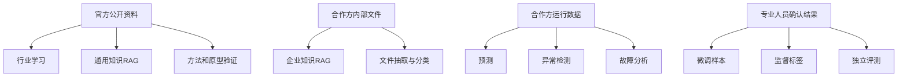
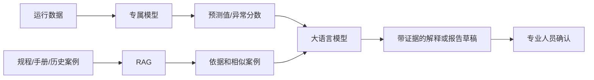

# 核电与风电数据情况调研

## ——大模型、RAG 与专属模型项目视角

> 文档性质：合作前期调研材料  
> 适用对象：项目负责人、产品、算法、研发及合作沟通人员  
> 当前状态：尚未确认合作场景及获取合作方相关数据  
> 调研边界：研究数据可获得性、用途和模型影响

## 1. 调研背景与目的

当前项目可能进入核电或风电领域，但合作方向和业务场景尚未确定。为了避免在场景不明确时盲目采集数据，本次调研重点回答以下问题：

1. 核电和风电分别有哪些数据可以从官方或公开渠道获得？
2. 哪些关键数据通常无法公开获得，需要合作方提供？
3. 不同数据用于项目时，需要关注哪些专业条件和使用限制？
4. 公开数据和合作方数据分别能支持哪些模型工作？
5. 什么情况下应选择 RAG、微调或专属模型？
6. 后续与合作方沟通时，应该围绕什么提出数据需求？

本文可用于：

- 项目内部学习和方案讨论；
- 与潜在合作方进行前期沟通；
- 场景确定后编写正式数据需求；
- 判断某类数据能否支持预期模型任务。

本文不用于：

- 代替核电或风电专业判断；
- 直接确定数据能否对外提供；
- 直接确定数据是否涉密或是否属于重要数据；
- 规定合作方内部的数据管理和交付流程；
- 在没有真实样本的情况下承诺模型效果。

---

## 2. 核心结论

### 2.1 一句话结论

> 公开数据可以帮助团队“理解行业、搭建通用知识库和验证技术方法”，合作方数据才能帮助团队“解决具体业务问题并形成可落地模型”。

### 2.2 主要判断

1. **核电公开数据以监管文件、年度报告、公开事件和聚合指标为主。**

   详细设备信息、内部程序、运行时序、报警、缺陷和维修结论通常需要合作方提供。

2. **风电公开数据比核电丰富，但大量数据属于行业统计、气象再分析、资源图谱或模拟功率。**

   这些数据不等同于具体场站的 SCADA、实际天气预报、限电指令和故障记录。

3. **公开可访问不等于可以直接用于模型训练。**

   仍需确认版权、许可、署名、接口限制、商业使用和数据更新条件。

4. **原始专业文档优先用于 RAG，不应因为“专业性强”就直接用于微调。**

   微调需要明确的业务输入、专家确认输出和边界样本。

5. **功率预测、参数预测、异常检测和设备故障识别主要依赖专属模型。**

   大语言模型更适合知识检索、信息抽取、案例组织和结果解释。

6. **决定模型效果的关键不是数据总行数，而是数据是否与最终场景一致。**

   需要关注对象、时间、状态、版本、关联关系、标签来源和测试独立性。

### 2.3 数据与模型的总体关系



---

## 3. 本次调研的数据分类方法

这里的数据分类只用于说明“数据从哪里获得”，不是安全等级或权限等级。

| 类别       | 含义                                       | 典型例子                       |
| ---------- | ------------------------------------------ | ------------------------------ |
| 公开获取   | 可从政府、监管机构、国际组织等公开页面获取 | 法规、年报、行业统计           |
| 有条件获取 | 需要注册、申请、购买或遵守特定许可         | 气象产品、标准全文、部分数据库 |
| 合作方提供 | 与具体企业、场站、机组、设备和流程有关     | 内部文件、SCADA、工单          |
| 共同形成   | 需要我方和合作方在项目中共同构造           | 专家问答、任务样本、评测集     |

需要特别区分以下概念：

- **实测数据**：由现场传感器或人工实际记录。
- **统计数据**：对原始数据按地区、月份或年度汇总。
- **再分析数据**：通过数值模型和历史观测融合得到。
- **预测数据**：在某个发布时间对未来作出的估计。
- **模拟数据**：在假设条件下通过物理或统计模型生成。
- **推导数据**：通过其他数据计算得到，例如理论功率或指标。

这些数据可能具有相同的字段名称，但不能在模型中视为同一种数据。

---

# 第一部分：核电数据调研

## 4. 核电数据总体特点

核电公开信息具有较强的监管属性，常见内容包括：

- 法律法规和核安全导则；
- 行政许可与环境影响评价信息；
- 监督检查报告；
- 核安全年报；
- 对外公开的运行事件；
- 流出物和周围环境辐射监测；
- 机组基础信息和年度运行指标。

核电企业实际用于运行、维修和设备管理的数据通常更细，包括：

- 电厂内部程序和规程；
- 系统、设备、部件和测点关系；
- 运行时序和报警；
- 缺陷、事件、工单和试验记录；
- 专业分析和最终确认结论。

因此，核电公开数据和企业运行数据之间存在明显粒度差异：

```text
公开数据
  法规/许可/年报/公开事件/聚合指标
                  ↓
          建立行业通用认识

合作方数据
  文件/设备/测点/报警/事件/工单/结论
                  ↓
          解决具体业务问题
```

## 5. 核电可以公开获取的数据

### 5.1 国内法规、监管和公开信息

| 数据内容           | 主要来源                                     | 常见形式            | 可以支持的工作                 | 使用注意                           |
| ------------------ | -------------------------------------------- | ------------------- | ------------------------------ | ---------------------------------- |
| 核安全法律法规     | 生态环境部、国家核安全局、国家法律法规数据库 | HTML、PDF           | 法规 RAG、术语解释、行业学习   | 保留发布机构、文号、生效和修订状态 |
| 核安全导则和政策   | 国家核安全局                                 | HTML、PDF           | 专业知识检索、法规体系理解     | 导则不应被错误表述为法律条文       |
| 行政许可与审批决定 | 国家核安全局、生态环境部                     | HTML、PDF           | 许可事项检索、文件抽取         | 注意适用设施、机组和许可阶段       |
| 监督检查报告       | 国家核安全局及地区监督站                     | HTML、PDF           | 检查问题和监管要求检索         | 公开范围和文件完整度可能不同       |
| 国家核安全局年报   | 国家核安全局                                 | PDF                 | 行业总体安全情况、年度报告问答 | 以宏观和年度汇总信息为主           |
| 公开运行事件       | 国家核安全局、营运单位公开页面               | HTML、PDF           | 事件检索、公开经验反馈         | 不是完整的内部事件数据库           |
| 核设施安全状况     | 营运单位公开页面                             | HTML、PDF           | 电厂公开信息问答               | 内容粒度由公开要求决定             |
| 流出物排放         | 营运单位公开页面                             | 表格、PDF           | 环境公开数据查询               | 不等于反应堆内部运行参数           |
| 周围环境监测       | 营运单位、监管机构                           | 表格、PDF、公开平台 | 环境趋势和公开信息分析         | 需要确认监测点、单位和统计周期     |

《核安全信息公开办法》明确，核动力厂营运单位应公开许可证件、核设施安全状况、INES 1 级及以上运行事件、流出物、周围环境监测和年度核安全报告；监管部门还应公开法规、许可、监督检查、总体安全状况和年报等信息。

权威入口：

- [生态环境部：《核安全信息公开办法》](https://www.mee.gov.cn/xxgk2018/xxgk/xxgk03/202009/t20200916_798535.html)
- [生态环境部：《中华人民共和国核安全法》](https://www.mee.gov.cn/ywgz/fgbz/fl/202110/t20211028_958223.shtml)
- [国家核安全局：政策法规](https://nnsa.mee.gov.cn/zcfg_8964/)
- [国家核安全局：核安全年报](https://nnsa.mee.gov.cn/ztzl/haqbg/haqnb_1/index.html)
- [国家核安全局：反应堆监管信息](https://nnsa.mee.gov.cn/ywdh/fyd/)

### 5.2 国际机组和运行统计

IAEA 的 PRIS（Power Reactor Information System）提供全球核电机组信息，公开内容通常包括：

- 机组名称和所在国家；
- 反应堆类型和型号；
- 业主和运营单位；
- 额定容量和热功率；
- 首次并网和商业运行时间；
- 运行、在建、停运等状态；
- 年度发电量和部分性能指标；
- 机组历史运行表现。

[IAEA PRIS 说明](https://pris.iaea.org/PRIS/About.aspx)指出，PRIS 包含反应堆规格、设计特征、发电、能量损失、停运和运行事件等信息，但公共网站、注册用户系统和数据填报系统的可访问范围不同。

适合：

- 全球核电基础数据查询；
- 机组和堆型统计；
- 年度性能指标分析；
- 通用核电知识库；
- 公开数据处理方法验证。

不适合：

- 设备级故障诊断；
- 实时运行状态判断；
- 特定机组测点预测；
- 内部程序或维修辅助；
- 直接构造完整的异常训练数据。

### 5.3 国外监管和运行经验数据

美国 NRC 公开的数据和文件包括：

- 反应堆每日状态；
- 事件通知；
- 反应堆停堆信息；
- 检查报告；
- 发现项和违规记录；
- 技术报告；
- 许可、安全评价和监管往来文件。

主要入口：

- [NRC Data](https://www.nrc.gov/data/index)
- [NRC Reports Associated with Events](https://www.nrc.gov/reading-rm/doc-collections/event-status/index)
- [NRC ADAMS](https://www.nrc.gov/reactors/new-reactors/advanced/new-app/general-info/adams)

这些资料适合学习核电监管文件和运行事件的组织方式，但需要明确：

- 适用的是美国监管体系；
- 文件中的法规和许可结论不能直接用于中国项目；
- 不同国家的机组设计和报告规则不同；
- 公开事件通常无法还原完整的现场数据和内部分析过程。

### 5.4 公开但存在访问边界的数据

| 数据                      | 访问特点                     | 项目影响                                 |
| ------------------------- | ---------------------------- | ---------------------------------------- |
| IAEA IRS 国际运行经验系统 | 面向核工业专业组织，访问受限 | 不能假定所有国际事件报告都可以公开下载   |
| 部分核安全标准全文        | 可能需要购买或机构授权       | 只能在许可允许的范围内索引、复制和训练   |
| 企业公开报告              | 可以阅读但仍可能受版权保护   | 公开访问不自动等于可以批量训练或再次分发 |
| 数据库高级统计功能        | 可能需要注册或申请           | 采集前确认账户、接口和使用条款           |

[IAEA IRS](https://nucleus.iaea.org/Pages/irs1.aspx)用于参与国核工业专业组织交换具有安全意义的运行经验，并不是普通公众事件数据库。

## 6. 核电需要合作方提供的数据

### 6.1 企业文件和知识

| 数据内容     | 主要用途                   | 最低需要理解的信息                 |
| ------------ | -------------------------- | ---------------------------------- |
| 管理程序     | 企业知识 RAG               | 文件编号、版本、有效状态、适用范围 |
| 运行规程     | 程序检索、运行辅助信息查询 | 适用机组、工况和授权边界           |
| 维修规程     | 维修知识问答、步骤检索     | 适用设备、版本和前提条件           |
| 试验程序     | 试验知识检索、结果抽取     | 试验对象、条件和验收结论           |
| 设备手册     | 设备知识 RAG               | 厂家、型号、版本和设备对应关系     |
| 内部经验反馈 | 相似案例检索               | 设备、现象、原因、措施和结论       |
| 内部报告     | 抽取、分类和摘要           | 报告类型、审核状态和目标输出       |

企业文件是核电企业级 RAG 的主要数据。公开法规只能回答通用监管问题，无法替代合作方内部有效程序。

### 6.2 设备与对象关系

需要合作方解释或提供：

```text
电厂
└─ 机组
   └─ 系统
      └─ 设备
         ├─ 部件
         ├─ 测点
         ├─ 报警
         ├─ 缺陷/事件
         ├─ 工单/试验
         └─ 关联文件
```

这一层数据用于解决：

- 同一设备在不同系统中的名称差异；
- 文件与设备的对应关系；
- 测点、报警和工单的关联；
- 同类设备跨机组比较；
- 技术改造前后数据的区分；
- 检索结果按机组、系统和设备过滤。

### 6.3 运行时序数据

可能包括：

- 功率；
- 压力；
- 温度；
- 流量；
- 液位；
- 振动；
- 阀门和执行机构位置；
- 电流、电压和频率；
- 设备启停状态；
- 计算量和质量状态。

最低要求不是合作方重新整理数据，而是能够说明：

- 数据来自哪个系统；
- 覆盖哪个机组和时间范围；
- 时间戳表示什么；
- 单位和采样方式是什么；
- 是否包含无效、替代或异常测量；
- 机组当时处于什么工况；
- 测点或设备是否发生过变更。

### 6.4 报警、缺陷、事件和工单

仅有测点曲线通常无法给出可靠原因。还需要：

- 报警代码和发生、恢复时间；
- 机组和设备状态；
- 缺陷或事件描述；
- 检查过程；
- 初步原因；
- 最终确认原因；
- 维修或更换措施；
- 维修后的验证结果。

特别要区分：

- 报警不等于故障；
- 事件描述不等于根因；
- 初步分析不等于最终结论；
- 工单关闭不一定代表已经找到根因；
- 参数偏离不一定代表设备损坏。

### 6.5 专家确认数据

微调和可靠评测通常需要合作方专业人员参与形成：

- 真实业务问题；
- 正确答案及引用依据；
- 文件适用性判断；
- 文本分类结果；
- 信息抽取结果；
- 事件和原因标签；
- 无法判断或应当转人工的样本；
- 典型错误答案和纠正说明。

这类数据不会自然存在于一堆原始文件中，需要围绕确定任务共同形成。

## 7. 核电数据对模型工作的影响

| 数据条件                 | 可以考虑的工作                     | 不宜直接承诺的工作               |
| ------------------------ | ---------------------------------- | -------------------------------- |
| 只有公开法规和年报       | 通用核电 RAG、法规检索、行业问答   | 企业程序问答、机组故障诊断       |
| 加入企业内部有效文件     | 企业知识 RAG、文件定位、引用回答   | 参数预测和设备异常检测           |
| 加入设备关系、报警和工单 | 相似案例检索、事件关联、文本分类   | 高可靠故障预测仍需连续时序和标签 |
| 加入运行时序和工况       | 状态识别、趋势分析、异常检测       | 根因诊断仍需事件和专业结论       |
| 加入专家确认标签         | 微调、监督分类、故障模型、独立评测 | 仍不能超出数据覆盖范围作结论     |

IAEA 在核电 AI 应用研究中强调：

- 数据数量是否足够取决于具体应用；
- 数据必须与目标部署场景相关；
- 数据分布不平衡会导致模型偏向常见情况；
- 测量错误会传播到模型结果；
- 训练、验证和测试数据应保持合理独立；
- 单一电厂可能缺少足够的少见事件样本；
- 模型表现只能证明其在已测试数据范围内的能力。

参考：[IAEA：Artificial Intelligence for Nuclear Power Plants](https://www-pub.iaea.org/MTCD/Publications/PDF/p15866-PUB2119_web.pdf)

## 8. 核电数据特别注意事项

### 8.1 文件版本和适用性

核电 RAG 最重要的不是单纯语义相似，而是：

- 文件是否有效；
- 适用于哪个机组；
- 适用于哪个系统和设备；
- 适用于什么工况；
- 是否存在替代或修订文件。

### 8.2 少见事件数据不足

安全相关事件和严重故障数量少，导致：

- 类别极不平衡；
- 单一机组可能没有足够样本；
- 模型可能只学到正常运行；
- 随机划分数据容易夸大效果。

可以使用仿真或合成数据补充研究，但生产验证仍需要真实现场数据。

### 8.3 数据使用环境

合作前需要确认的不是复杂权限体系，而是几个直接影响技术路线的问题：

- 数据能否离开合作方环境；
- 能否使用外部云模型；
- 数据只能用于检索还是可以进入模型权重；
- 模型和衍生结果能否在其他项目复用；
- 项目结束后数据和模型如何处理。

### 8.4 公开不等于可以训练

公开网页、企业报告、国际标准和数据库可能仍受版权或使用条款约束。采集前应确认：

- 是否允许下载；
- 是否允许批量处理；
- 是否允许商业使用；
- 是否允许用于模型训练；
- 是否要求署名；
- 是否允许重新分发原文。

---

# 第二部分：风电数据调研

## 9. 风电数据总体特点

风电公开数据主要分为：

- 行业装机、发电量和利用率统计；
- 地面气象观测；
- 气象再分析数据；
- 风资源空间图谱；
- 模拟气象和模拟功率数据；
- 风机原理、标准和研究报告。

风电场实际业务数据主要包括：

- 机组和设备基础信息；
- SCADA 时序数据；
- 状态码和告警；
- 功率设定值、限电和降额；
- 场站气象观测；
- 历史天气预报；
- 工单、故障和维修记录；
- 设备和软件版本变更。

公开数据与场站数据的区别可以概括为：

```text
公开气象/资源/统计/模拟数据
              ↓
     了解资源和验证算法流程

场站实测/控制/告警/工单数据
              ↓
     训练和验证可落地的场站模型
```

## 10. 风电可以公开获取的数据

### 10.1 行业统计数据

| 数据内容             | 主要来源     | 常见粒度               | 可以支持的工作         | 局限                       |
| -------------------- | ------------ | ---------------------- | ---------------------- | -------------------------- |
| 风电装机容量         | 国家能源局   | 全国、地区、月度或年度 | 行业统计问答、趋势分析 | 不能用于单机预测           |
| 新增装机             | 国家能源局   | 全国、地区、年度       | 行业发展分析           | 不包含具体机组状态         |
| 风电发电量           | 国家能源局   | 全国或地区汇总         | 宏观报告和知识库       | 无法定位场站和设备原因     |
| 利用率和利用小时     | 国家能源局   | 全国或地区汇总         | 运行趋势和政策分析     | 指标口径和场站实际指标不同 |
| 电力市场和新能源报告 | 国家能源局等 | 年度、专题             | 政策和市场 RAG         | 不是实时调度和交易数据     |

入口：

- [国家能源局](https://www.nea.gov.cn/)
- [国家能源局：2025 年全国电力统计数据](https://www.nea.gov.cn/20260129/6874f211acd0417eab7ac10c3061a7c2/c.html)

### 10.2 中国气象数据

[中国气象数据网](https://data.cma.cn/)提供多类气象观测和气候产品。与风电可能有关的数据包括：

- 风速和风向；
- 温度；
- 气压；
- 湿度；
- 地面气象站信息；
- 气候统计；
- 部分格点和再分析产品。

使用时需要确认：

- 产品是否开放；
- 是否需要注册或申请；
- 测站位置和高度；
- 观测频率；
- 质量控制方式；
- 时间范围；
- 数据许可和引用要求。

地面气象站数据不一定能够直接代表风机轮毂高度和具体场站风况。

### 10.3 ERA5 再分析数据

[ERA5 小时级单层数据](https://cds.climate.copernicus.eu/datasets/reanalysis-era5-single-levels?tab=overview)提供：

- 1940 年至今的全球数据；
- 小时级时间分辨率；
- 常规产品约 0.25° 水平网格；
- 风速、温度、气压等大量变量；
- GRIB 等数据格式；
- 产品版本、引用信息和许可说明。

适合：

- 历史气象特征研究；
- 长周期风况分析；
- 模型方法验证；
- 缺少现场气象数据时构建初步基线；
- 与场站数据进行空间和时间匹配研究。

不应直接理解为：

- 风电场现场实测；
- 风机轮毂位置的真实风速；
- 当时实际提供给业务人员的天气预报；
- 具体风机真实发电功率。

### 10.4 Global Wind Atlas

[Global Wind Atlas](https://globalwindatlas.info/zh/about/introduction)提供：

- 多高度平均风速；
- 风功率密度；
- 地形和粗糙度；
- 部分容量因子和 IEC 类别信息；
- 全球、国家和区域 GIS 数据。

其方法以再分析和数值模型为基础，通过中尺度和微尺度降尺度得到高分辨率风资源估计。[Global Wind Atlas 方法说明](https://globalwindatlas.info/en/about/method)

适合：

- 前期风资源认识；
- 空间数据处理原型；
- 选址和区域对比的初步研究；
- 地理信息与模型特征研究。

不适合：

- 替代现场测风；
- 直接作为具体风场发电承诺；
- 代替工程设计和投资决策；
- 直接训练特定场站的故障模型。

[Global Wind Atlas 使用条款](https://globalwindatlas.info/zh/about/TermsOfUse)说明，多数材料采用 CC BY 4.0，但要求正确署名，同时声明其数据主要用于一般信息和初步研究。

### 10.5 NREL WIND Toolkit

[NREL WIND Toolkit](https://www.nrel.gov/grid/wind-toolkit)包括：

- 模拟气象数据；
- 不同高度的风速和风向；
- 基于风况和功率曲线计算的功率数据；
- 不同预测提前量的预测数据；
- 面向电力系统和预测研究的数据。

适合：

- 功率预测流程原型；
- 时空数据处理；
- 特征工程；
- 预测模型基线；
- 风电并网研究方法学习。

需要注意：

- 覆盖区域和年份有限；
- 气象数据来自模型；
- 功率数据是计算结果；
- 不能代表中国具体场站；
- 不能替代真实 SCADA 和实际历史天气预报。

### 10.6 标准、技术资料和研究数据

公开资料还包括：

- 风机原理和行业科普；
- IEC 61400 标准目录和部分介绍；
- 国家标准目录；
- 研究机构报告；
- 少量匿名化或试验型 SCADA 数据。

主要入口：

- [IEC 61400-1](https://webstore.iec.ch/en/publication/26423)
- [IEC 61400-12 系列](https://webstore.iec.ch/en/publication/69211)
- [国家标准全文公开系统](https://std.samr.gov.cn/)
- [NREL：使用 SCADA 数据进行风机故障检测](https://docs.nrel.gov/docs/fy12osti/51653.pdf)

标准全文、厂商手册和研究数据附件需要分别确认许可。少量公开 SCADA 数据可以验证算法，但通常无法覆盖合作方机型、控制版本和真实故障分布。

## 11. 风电需要合作方提供的数据

### 11.1 场站、机组和设备信息

| 数据内容             | 主要作用                   |
| -------------------- | -------------------------- |
| 场站和机组编号       | 连接所有数据源             |
| 机型和额定容量       | 区分不同机组的运行特性     |
| 轮毂高度和叶轮直径   | 解释气象和功率关系         |
| 齿轮箱或直驱路线     | 区分部件和故障模式         |
| 理论功率曲线         | 性能分析和功率偏差研究     |
| 控制器和软件版本     | 解释状态码、控制和数据变化 |
| 投运、改造和更换时间 | 区分不同生命周期数据       |
| 场站布局和机位关系   | 分析尾流和空间影响         |

### 11.2 SCADA 时序数据

可能包括：

- 机舱风速和风向；
- 有功和无功功率；
- 发电机和叶轮转速；
- 桨距角；
- 偏航位置和偏航误差；
- 齿轮箱、轴承和发电机温度；
- 电流、电压和变流器数据；
- 环境温度；
- 状态和控制量；
- 均值、最大值、最小值和标准差。

不宜预先规定合作方必须提供固定字段，但需要解释：

- 实际有哪些测点；
- 采样和聚合周期；
- 单位；
- 缺失和无效值如何表现；
- 不同机型的同名测点是否同义；
- 测点是否发生过变更；
- 数据时间是否与其他系统一致。

### 11.3 状态、告警和控制数据

必须尽量获得：

- 正常发电、待机、停机和检修状态；
- 告警代码和告警文本；
- 告警发生、恢复和确认时间；
- 功率设定值；
- 限电指令；
- 降额运行；
- 特殊天气和保护状态；
- 场站控制模式。

如果缺少这些数据，模型可能把以下情况错误识别为设备异常：

- 电网限电；
- 人工停机；
- 定期维护；
- 高风速保护；
- 低温或结冰控制；
- 传感器失效；
- 场站功率控制。

### 11.4 场站气象和天气预报

需要区分：

| 数据               | 关键时间               | 主要用途           |
| ------------------ | ---------------------- | ------------------ |
| 测风塔或气象站观测 | 实际观测时间           | 场站风况和模型校准 |
| 激光雷达数据       | 实际观测时间和高度     | 垂直风廓线分析     |
| 机舱风速           | 风机采集时间           | 单机运行分析       |
| 数值天气预报       | 预报发布时间＋目标时间 | 可上线的功率预测   |
| 再分析数据         | 对应历史时间           | 历史研究和补充特征 |

功率预测特别需要保存历史天气预报的原始版本。使用事后更新的气象产品训练，会造成模型上线时无法复现。

### 11.5 工单、故障和维修

需要的数据包括：

- 故障现象；
- 故障部件；
- 发生或发现时间；
- 检查过程；
- 初步原因；
- 最终确认原因；
- 维修和更换措施；
- 恢复时间；
- 维修后的运行结果；
- 对应告警和 SCADA 时间窗口。

故障预测的数据价值主要取决于：

- 每类故障有多少经过确认的实例；
- 是否覆盖多个机组；
- 是否保留故障前的数据；
- 是否有维修后验证；
- 标签是否为最终结论。

### 11.6 企业内部文件

包括：

- 风机设备手册；
- 告警码说明；
- 检修规程；
- 故障处理指导；
- 运行管理制度；
- 历史故障案例；
- 技术改造资料；
- 厂商服务报告。

这些文件是风电企业知识 RAG 和故障案例检索的主要数据。

## 12. 风电数据对模型工作的影响

| 数据条件                  | 可以考虑的工作                 | 不宜直接承诺的工作               |
| ------------------------- | ------------------------------ | -------------------------------- |
| 只有行业统计              | 行业问答、趋势报告             | 单机预测、故障诊断               |
| 加入 ERA5 或 WIND Toolkit | 功率预测流程原型、气象特征研究 | 特定场站生产预测                 |
| 加入场站 SCADA            | 功率曲线、性能分析、异常检测   | 如果没有状态和限电，结论仍不可靠 |
| 加入状态、控制和限电      | 正常样本筛选、功率损失分析     | 故障根因仍需工单和专业确认       |
| 加入告警和工单            | 故障分类、事件检索、案例 RAG   | 少见故障预测仍受样本数量限制     |
| 加入历史 NWP              | 可复现的功率预测               | 若缺少发布时间，可能出现时间泄漏 |
| 加入专家确认标签          | 微调、监督诊断、独立评测       | 仍不能自动推广到不同机型和场站   |

## 13. 风电数据特别注意事项

### 13.1 限电和状态

风速和功率数据本身不足以判断设备性能。没有状态、设定值和限电信息时，模型容易把正常控制行为识别为故障。

### 13.2 机型和版本差异

不同机型可能具有：

- 不同测点；
- 不同控制逻辑；
- 不同状态码；
- 不同功率曲线；
- 不同故障模式；
- 不同采样方式。

同名字段不能未经确认直接合并训练。

### 13.3 时间泄漏

以下做法会使离线结果虚高：

- 使用事件发生后才产生的工单结论预测事件；
- 使用事后更新的天气数据预测过去功率；
- 随机拆分同一事件前后的相邻记录；
- 把同一机组连续时间段同时放入训练和测试。

### 13.4 公开气象数据的定位

公开气象和风资源数据适合：

- 补充背景；
- 建立基线；
- 验证数据处理代码；
- 做预训练或迁移学习研究。

最终模型仍需要使用场站真实数据进行校准和独立测试。

---

# 第三部分：模型路线和数据影响

## 14. RAG、微调和专属模型的区别

| 路线       | 主要解决的问题         | 主要数据                     | 数据是否进入模型权重 |
| ---------- | ---------------------- | ---------------------------- | -------------------- |
| RAG        | 查找知识、依据和案例   | 法规、规程、手册、报告、案例 | 通常不进入           |
| 监督微调   | 学习固定任务和输出行为 | 输入与专家正确输出样本       | 会进入               |
| 继续预训练 | 学习领域语言和表达分布 | 大规模领域语料               | 会进入               |
| 专属模型   | 数值预测、检测和识别   | 时序、表格、图像、信号、标签 | 形成专属模型参数     |
| 组合方案   | 检索、计算和解释协同   | 文档＋结构化数据＋模型结果   | 视组成部分而定       |

### 14.1 RAG 的数据影响

RAG 最关心：

- 文件是否完整；
- 结构能否识别；
- 版本是否有效；
- 适用范围是否明确；
- 能否引用到章节和页码；
- 专业术语和对象能否关联。

适合：

- 法规问答；
- 程序和手册查询；
- 相似事件检索；
- 故障案例检索；
- 报告依据定位。

公开文件可以建立通用 RAG，合作方内部文件才能形成企业业务价值。

### 14.2 监督微调的数据影响

监督微调需要：

```text
业务输入
+ 当时实际可用的上下文
+ 专家确认的正确输出
+ 适用条件
+ 边界和拒绝样本
```

适合：

- 工单分类；
- 报告信息抽取；
- 固定格式摘要；
- 故障文本分类；
- 告警文本标准化；
- 受控问答和拒答；
- 查询条件生成。

原始文档不能直接等同于监督微调数据。把文件内容做成问答时，还要避免：

- 答案脱离原文；
- 使用失效文件；
- 自动生成问题未经专业确认；
- 只生成简单记忆题；
- 训练样本和评测问题重复。

### 14.3 继续预训练的影响

继续预训练可能帮助模型学习：

- 领域术语；
- 缩写；
- 行业语言风格；
- 专业文本分布。

但它不能天然解决：

- 知识更新；
- 文件引用；
- 版本失效；
- 企业内部适用性；
- 故障标签不足；
- 高风险回答边界。

在场景和数据规模尚未明确时，不应优先决定继续预训练。

### 14.4 专属模型的数据影响

专属模型通常包括：

- 风功率预测；
- 核电参数趋势预测；
- 设备异常检测；
- 故障分类；
- 剩余寿命估计；
- 图像和振动信号识别。

主要数据要求：

- 数据与上线环境一致；
- 正常和目标事件覆盖充分；
- 时间和设备关系正确；
- 工况、状态和控制信息完整；
- 标签来源可靠；
- 训练和测试相互独立；
- 设备或系统变化可以识别。

### 14.5 组合路线

典型组合：



这种方式比让大语言模型直接分析所有原始时序更现实：

- 专属模型负责数值计算；
- RAG 负责寻找依据；
- 大模型负责组织语言和人机交互；
- 专业人员负责最终判断。

## 15. 数据对模型效果的直接影响

| 数据问题             | 可能造成的模型问题             |
| -------------------- | ------------------------------ |
| 文件版本不明         | 回答引用失效依据               |
| 对象关系缺失         | 文件、设备、测点和工单无法关联 |
| 缺少工况或状态       | 正常变化被识别为异常           |
| 缺少限电信息         | 风机正常限功率被识别为性能下降 |
| 初步结论当最终标签   | 模型学习错误原因               |
| 少见类别样本太少     | 模型偏向常见状态               |
| 训练和测试相邻       | 离线指标虚高                   |
| 不同机型直接混合     | 模型学习相互冲突的规律         |
| 实测和模拟数据混淆   | 上线效果与实验效果差异大       |
| 使用事后数据训练     | 上线时无法取得同样输入         |
| 只看文本流畅度       | 专业错误和错误引用无法被发现   |
| 私有数据进入模型权重 | 后续删除、隔离和复用边界变复杂 |

## 16. 公开数据能够做到什么程度

### 16.1 核电

公开数据可以支持：

- 核电行业入门知识库；
- 法规、年报和公开信息 RAG；
- 公开事件信息抽取；
- 监管报告分类和检索；
- 反应堆与年度指标统计；
- 原型界面和检索流程验证。

公开数据通常不能支持：

- 特定核电厂内部程序问答；
- 特定设备实时状态分析；
- 测点异常预测；
- 设备根因诊断；
- 维修决策；
- 企业内部专业评测。

### 16.2 风电

公开数据可以支持：

- 风电行业知识库；
- 装机和发电趋势分析；
- 风资源空间分析；
- 气象特征研究；
- 功率预测方法原型；
- 时序处理和可视化验证。

公开数据通常不能支持：

- 特定场站正式功率预测；
- 单台风机性能评价；
- 限电损失准确识别；
- 特定机型故障诊断；
- 工单和告警关联；
- 场站实际运维决策。

---

# 第四部分：后续工作建议

## 17. 当前阶段应该做什么

在没有合同和场景的情况下，建议只做以下工作：

### 17.1 建立公开来源认识

对候选官方来源了解：

- 发布机构；
- 数据内容；
- 数据粒度；
- 更新时间；
- 数据性质；
- 使用条件；
- 可能支持的模型任务；
- 明确不能支持的任务。

当前不需要立即批量下载全部数据。

### 17.2 完成内部知识准备

团队需要能够说明：

- 核电和风电的数据结构有什么区别；
- 公开数据为什么不能替代企业数据；
- RAG、微调和专属模型分别需要什么；
- 为什么需要状态、版本和专家结论；
- 为什么不能只根据数据行数判断可行性。

### 17.3 准备场景确定后的数据需求逻辑

合作方明确场景后，按照以下顺序提出数据需求：


## 18. 场景明确后的数据需求重点

### 18.1 知识问答或 RAG

需要：

- 场景范围内的有效文件；
- 文件版本和适用范围；
- 文件之间的替代或引用关系；
- 设备或业务对象与文件的关系；
- 真实用户问题；
- 正确引用和专家确认答案；
- 应当拒答或转人工的问题。

### 18.2 文本抽取、分类或微调

需要：

- 真实业务输入；
- 明确目标字段或类别；
- 专家确认输出；
- 类别定义；
- 边界和复杂样本；
- 独立评测样本。

### 18.3 风功率预测

需要：

- 场站和机组信息；
- 历史功率和 SCADA；
- 历史天气预报；
- 实际气象观测；
- 状态和限电信息；
- 功率设定值；
- 时间和机组独立的测试数据。

数据原则上需要覆盖完整季节变化，是否足够还要通过按时间划分的测试确定。

### 18.4 异常检测和故障分析

需要：

- 连续运行时序；
- 机组或设备状态；
- 报警；
- 缺陷或工单；
- 故障确认；
- 维修和恢复结果；
- 故障前后时间窗口；
- 正常但容易误判的情况。

### 18.5 核电运行数据分析

需要：

- 机组、系统、设备和测点关系；
- 运行时序；
- 工况；
- 报警和事件；
- 试验及检修活动；
- 设备和测点变更；
- 专业确认结论；
- 明确的模型使用边界。

## 19. 合作方数据的最低说明要求

不要求合作方使用我方预设格式，也不要求其提前完成复杂清洗。为了理解数据，至少需要说明：

1. 数据或文件是什么。
2. 来自哪个业务系统或专业流程。
3. 覆盖哪些对象和时间。
4. 时间、单位和统计方式是什么。
5. 不同数据如何通过现有编号或时间关联。
6. 状态、代码和特殊值代表什么。
7. 哪些结论是自动产生，哪些经过专业人员确认。
8. 已知有哪些缺失、变更或特殊情况。
9. 数据允许用于检索、训练还是只用于评测。

这些内容可以通过现有说明、交付备注和样例走查完成，不需要合作方重新建设一套数据规范。

## 20. 建议的项目优先级

### 第一优先级：先确定场景

明确：

- 谁使用；
- 解决什么问题；
- 输入是什么；
- 输出是什么；
- 错误代价是什么；
- 是否需要人工确认。

### 第二优先级：验证真实样例

先走查少量：

- 典型正常情况；
- 典型目标情况；
- 容易误判的情况；
- 信息不足、无法判断的情况。

### 第三优先级：形成数据需求

根据真实判断过程明确：

- 需要哪些文件；
- 需要哪些运行数据；
- 需要哪些关联关系；
- 需要哪些专业结论；
- 哪些数据用于 RAG；
- 哪些数据用于微调或专属模型；
- 哪些数据只作为评测。

### 第四优先级：收到数据后再确定处理方案

在看到真实数据后决定：

- 文档如何解析；
- 表格和图片如何保留；
- 时序如何对齐；
- 状态和事件如何关联；
- 标签如何构造；
- 模型如何划分训练和测试；
- 最终选择何种技术路线。

---

# 第五部分：汇报建议

## 21. 建议的汇报主线

向其他人员汇报时，可以按以下六个问题展开：

### 第一页：为什么要调研数据

> 当前方向和场景尚未确定，先弄清数据可获得性和模型边界，避免提前采集大量最终无法使用的数据。

### 第二页：公开数据能做什么

> 公开数据主要解决行业学习、通用知识 RAG 和方法验证问题。

### 第三页：为什么还需要合作方数据

> 真正业务价值依赖企业内部文件、设备关系、运行数据、告警工单和专业确认结果。

### 第四页：核电和风电的主要区别

| 核电                               | 风电                                 |
| ---------------------------------- | ------------------------------------ |
| 公开数据以监管文件和聚合信息为主   | 公开气象、资源和模拟数据较丰富       |
| 企业运行数据敏感性和专业边界更高   | 场站真实 SCADA 和故障数据仍不公开    |
| 重点关注文件适用性、工况和专业授权 | 重点关注状态、限电、机型和时间对齐   |
| 少见事件和高风险判断限制模型训练   | 跨场站、跨机型和季节变化限制模型泛化 |

### 第五页：数据如何影响模型路线

> 文件知识优先走 RAG；稳定的输入输出任务才考虑微调；数值预测和故障检测使用专属模型；最终通常是组合方案。

### 第六页：项目下一步

> 当前先保留公开来源和行业知识；合作明确后确定一个领域和一个场景，再根据实际工作流程形成数据需求。

## 22. 汇报时可以直接使用的结论

### 关于公开数据

> 公开数据不是没有价值，它主要用于建立行业底座和验证方法；但不能替代合作方真实业务数据。

### 关于微调

> 专业文档多不等于适合微调。知识更新和依据引用优先使用 RAG，微调解决的是稳定任务和输出行为。

### 关于时序模型

> 时序数据行数大不代表有效样本多。状态、工况、限电、事件标签和测试独立性才决定模型是否可信。

### 关于合作方数据

> 我们不要求合作方重新整理成复杂格式，只需要围绕确定场景提供现有材料，并由专业人员解释关键含义和确认结果。

### 关于技术选型

> 在没有确定场景、真实样例和专业评价标准前，不宜先确定模型、向量库或训练路线。

## 23. 常见问题及回答

### 问：只使用公开数据能不能先训练一个行业模型？

可以做通用行业知识、术语和方法原型，但不能据此证明模型适用于某个核电厂或风电场。公开语料更适合先做 RAG；是否继续预训练，需要结合语料规模、许可和明确收益判断。

### 问：合作方把所有文件给我们是不是就能微调？

不能。文件适合先做知识检索。微调还需要明确任务、正确输出、专家确认和独立评测。

### 问：有几年 SCADA 数据是不是就能做故障预测？

不一定。需要看是否有状态、告警、工单、故障确认、维修结果，以及每类故障实际有多少独立实例。

### 问：ERA5 能不能直接做风场功率预测？

可以用于研究和基线，但生产预测还需要具体场站 SCADA、历史天气预报、状态、限电和真实测试数据。

### 问：核电公开事件能不能训练故障诊断模型？

公开事件适合文本检索和信息抽取，通常缺少连续测点、完整设备关系和内部确认过程，不能直接替代现场故障训练数据。

### 问：为什么必须保留独立评测数据？

如果训练样本和测试样本来自同一文件、相邻时间或同一事件，模型可能只是记忆内容，无法证明面对新问题仍然有效。

---

## 24. 调研结论

核电和风电都具备一定规模的公开资料，但公开数据与真实业务数据承担不同作用：

- 公开资料用于行业基础、通用知识、来源引用和方法预研；
- 合作方文件用于企业知识检索和文本任务；
- 合作方运行数据用于预测、检测和诊断；
- 专业确认结果用于微调、监督标签和最终评测。

当前阶段最合理的操作是：

1. 保留核电和风电两套公开来源研究。
2. 不进行大规模数据采集。
3. 不提前规定统一 Schema 或合作方内部流程。
4. 等合作方向和单一场景明确。
5. 根据现有专业工作流程形成数据需求。
6. 通过少量真实样例确认理解。
7. 收到数据后再决定清洗、RAG、微调或专属模型方案。

最终项目的核心不是“收集尽可能多的数据”，而是：

> 围绕一个明确场景，获得足以还原专业判断过程、支持独立验证并允许在约定范围内使用的数据。

---

## 25. 主要权威参考资料

### 核电

- [生态环境部：《中华人民共和国核安全法》](https://www.mee.gov.cn/ywgz/fgbz/fl/202110/t20211028_958223.shtml)
- [生态环境部：《核安全信息公开办法》](https://www.mee.gov.cn/xxgk2018/xxgk/xxgk03/202009/t20200916_798535.html)
- [国家核安全局：政策法规](https://nnsa.mee.gov.cn/zcfg_8964/)
- [国家核安全局：核安全年报](https://nnsa.mee.gov.cn/ztzl/haqbg/haqnb_1/index.html)
- [IAEA PRIS](https://pris.iaea.org/PRIS/About.aspx)
- [IAEA IRS](https://nucleus.iaea.org/Pages/irs1.aspx)
- [IAEA：Artificial Intelligence for Nuclear Power Plants](https://www-pub.iaea.org/MTCD/Publications/PDF/p15866-PUB2119_web.pdf)
- [NRC Data](https://www.nrc.gov/data/index)
- [NRC ADAMS](https://www.nrc.gov/reactors/new-reactors/advanced/new-app/general-info/adams)

### 风电

- [国家能源局](https://www.nea.gov.cn/)
- [中国气象数据网](https://data.cma.cn/)
- [ERA5 小时级单层数据](https://cds.climate.copernicus.eu/datasets/reanalysis-era5-single-levels?tab=overview)
- [Global Wind Atlas](https://globalwindatlas.info/zh/about/introduction)
- [Global Wind Atlas 方法说明](https://globalwindatlas.info/en/about/method)
- [Global Wind Atlas 使用条款](https://globalwindatlas.info/zh/about/TermsOfUse)
- [NREL WIND Toolkit](https://www.nrel.gov/grid/wind-toolkit)
- [NREL：Use of SCADA Data for Failure Detection in Wind Turbines](https://docs.nrel.gov/docs/fy12osti/51653.pdf)
- [IEC 61400-1](https://webstore.iec.ch/en/publication/26423)
- [IEC 61400-12 系列](https://webstore.iec.ch/en/publication/69211)

> 公开页面、数据内容和使用条款可能更新。实际采集或训练前，需要再次确认当时有效的版本和许可条件。
