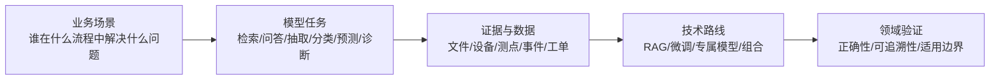
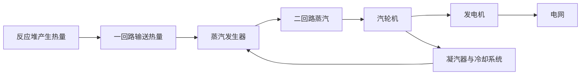
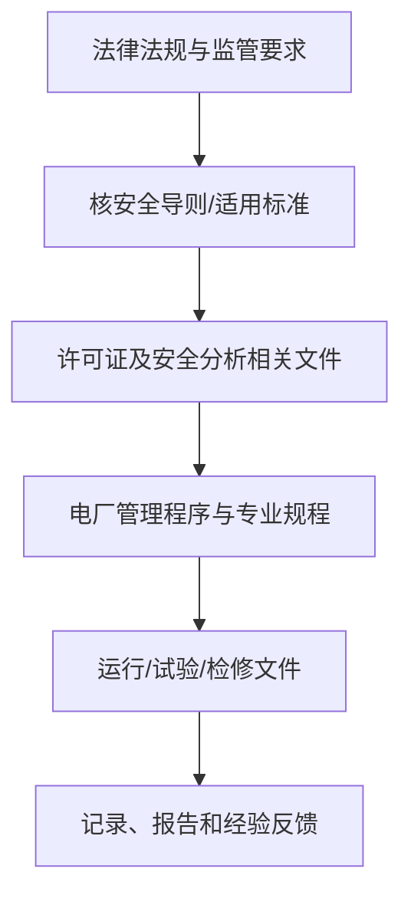
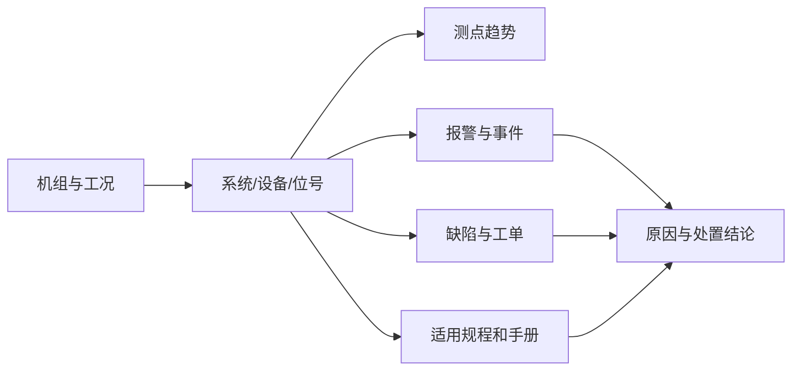
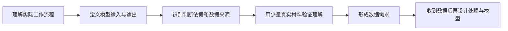
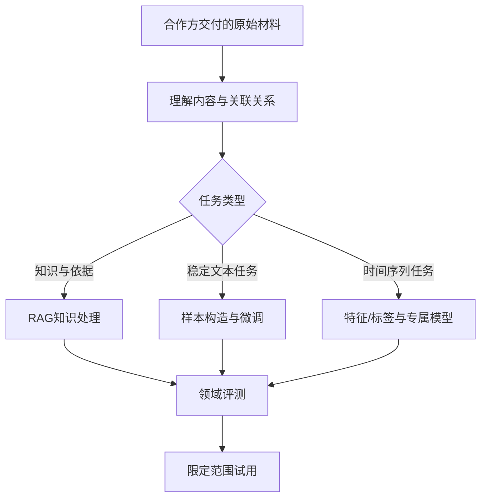

# 核电大模型项目入门

## 1. 文档定位

本文面向熟悉大模型或数据项目，但尚未参与过核电项目的产品、算法、研发和项目人员。

目标不是补一门核工程课程，而是帮助团队在合作初期做到三件事：

1. 听懂合作方描述的业务对象、文件、数据和工作流程。
2. 把业务问题转换成可验证的大模型或专属模型任务。
3. 判断需要什么数据、数据之间如何关联，以及哪些问题必须由领域专家确认。

本文是项目沟通和技术设计的入门材料，不是核电设计、运行、检修、核安全或应急决策依据。涉及专业判断时，以适用的法律法规、监管要求、许可文件和合作方批准文件为准。

---

## 2. 先从最终项目看核电知识

本项目关心的不是“知道多少核电知识”，而是知识和数据能否支撑一个明确任务。



合作方通常会从业务流程、设备或专业系统出发描述需求；大模型团队需要把这些描述转换为：

- 输入是什么；
- 输出供谁使用；
- 输出是否必须引用依据；
- 错误的代价是什么；
- 需要通用知识、企业内部知识，还是历史运行规律；
- 是否存在可以复现的历史样本和判断结果。

没有这些信息，不宜先决定“做 RAG”或“做微调”。

---

## 3. 最小必要行业框架

### 3.1 核电站的能量转换

以压水堆为例，可以把发电过程简化为：



对数据项目最有用的认识是：

- 核电站是由大量相互关联的系统、设备、测点和控制逻辑组成的复杂工业系统。
- 同一个名称可能分别指设备类型、具体设备、所属系统、文件章节或测点语义，必须结合上下文判断。
- 正常运行、启动停运、试验、检修和异常状态的数据分布不同，不能直接混合解释。
- 一回路、二回路、电气系统和辅助系统的数据存在物理与时间关联，单点异常不一定代表设备故障。

基础原理可参考 [NRC：压水堆定义](https://www.nrc.gov/reading-rm/basic-ref/glossary/pressurized-water-reactor-pwr)、[NRC Reactor Concepts Manual：核能发电](https://www.nrc.gov/reading-rm/basic-ref/students/for-educators/01.pdf) 和 [NRC：压水堆系统](https://ww2.nrc.gov/sites/default/files/doc_library/cdn/legacy/reading-rm/basic-ref/students/for-educators/04.pdf)。

### 3.2 需要认识的对象层级

核电项目中的数据通常不是孤立文件或孤立数值，而是围绕以下对象组织：

```text
电厂
└─ 机组
   └─ 系统
      └─ 设备
         ├─ 部件
         ├─ 测点
         ├─ 报警/缺陷
         ├─ 试验/检修活动
         └─ 关联文件
```

常见概念：

| 概念        | 项目中的意义                                               |
| ----------- | ---------------------------------------------------------- |
| 机组        | 同一电厂可能有多台机组；设计、投运时间和文件版本可能不同   |
| 系统        | 按功能组织的一组设备和管线，是文件与设备数据的重要关联维度 |
| 设备位号    | 标识具体设备或测点的编码，是跨数据源关联的常用键           |
| 工况        | 机组所处运行状态；决定参数是否可比较、规则是否适用         |
| 测点        | 温度、压力、流量、振动、阀位等观测或计算量                 |
| 报警        | 控制或监测系统按逻辑产生的提示，不自动等同于故障结论       |
| 缺陷/事件   | 经过业务流程登记的异常现象或问题，定义依合作方体系而定     |
| 工单/工作包 | 检查、试验、维修或更换等活动的执行记录                     |

具体编码规则、系统边界和状态定义应由合作方解释，不能从名称自行推断。

### 3.3 核电文件不是同一层级

文件的权威性、适用范围和用途不同。项目中常见：



这张图表达的是理解顺序，不代表所有文件都存在简单的上下级替代关系。对 RAG 来说，至少要识别：

- 发布或批准机构；
- 文档类型；
- 适用国家、设施、机组或专业；
- 版本、修订号和生效状态；
- 章节、条款、表格、附录和页码；
- 是否允许用于当前回答场景。

“搜到内容相近的段落”不等于“找到了当前问题适用的依据”。

### 3.4 安全相关内容应怎样处理

团队只需先理解三点：

1. 核安全强调多层次预防和保护，不能把单一设备或单一模型输出视为充分保证。
2. 许多问题具有明确的责任、授权和批准边界，模型不应替代被授权人员作出安全判断。
3. 回答是否正确，不仅取决于文字事实，还取决于文件版本、适用对象和当时工况。

进一步学习可查看 [国家核安全局：纵深防御](https://nnsa.mee.gov.cn/ztzl/haqshmhsh/hyfsaqkp/kptw/202406/t20240624_1076715.html)、[国家核安全局：核安全基本原则](https://nnsa.mee.gov.cn/ztzl/haqshmhsh/hyfsaqkp/kptw/202406/t20240624_1076723.html) 和 [IAEA Safety Glossary](https://www.iaea.org/sites/default/files/17/11/iaea-safety-glossary-rev2016.pdf)。

---

## 4. 从模型任务理解核电数据

### 4.1 常见数据及其能支撑的任务

| 数据类别                       | 典型内容                               | 主要用途                             | 单独使用时的局限                         |
| ------------------------------ | -------------------------------------- | ------------------------------------ | ---------------------------------------- |
| 公开法规、导则、标准和监管信息 | 条款、释义、监管要求、事件通报         | 行业知识库、检索问答、术语解释       | 不包含电厂内部程序和具体设备语义         |
| 内部制度、程序和技术文件       | 管理程序、运行规程、维修规程、技术手册 | 企业知识问答、程序查找、依据定位     | 强依赖版本、权限、适用机组和生效状态     |
| 设备与系统基础信息             | 层级、位号、型号、功能、所属系统       | 实体检索、跨源关联、设备知识图谱     | 不能直接说明某时刻设备状态               |
| 运行时序数据                   | 温度、压力、流量、功率、振动、阀位等   | 趋势分析、状态识别、异常检测、预测   | 缺少工况、质量标识和事件标签时难以解释   |
| 报警与事件记录                 | 报警代码、发生恢复时间、事件描述       | 报警归并、事件检索、异常样本构建     | 报警不等于故障原因，时间可能不同步       |
| 缺陷与工单                     | 现象、检查、原因、措施、结果           | 经验反馈、相似案例检索、维修文本任务 | 记录风格不一，结论可能在附件或后续记录中 |
| 试验与检修记录                 | 前提条件、步骤、结果、验收结论         | 表单抽取、结果核对、经验检索         | 需要理解执行版本和设备状态               |
| 专家判断与标注                 | 分类、原因、处置建议、适用性判断       | 监督微调、分类器、评测集             | 成本高，且可能存在专业分歧               |

### 4.2 数据关联比单一数据量更重要

一个典型问题可能需要如下证据链：



例如“某参数为何异常”不能只靠一条时序曲线回答，还可能需要：

- 当时处于什么运行状态；
- 相关设备是否切换、试验或检修；
- 测点是否有效；
- 同期有哪些报警；
- 后续检查确认了什么；
- 哪份文件规定了正常范围或处置方式。

因此，需求阶段要优先确认可用的关联标识和时间语义，而不是要求合作方先整理成统一格式。

### 4.3 文件与结构化数据的连接点

常见连接点包括：

- 设备位号；
- 系统编码；
- 文件编号和修订号；
- 工单、缺陷或事件编号；
- 机组编号；
- 发生、发现、记录、恢复和关闭时间；
- 专业术语、缩写及同义名称。

这些连接点不要求合作方为项目重新设计；项目团队应先理解其已有含义，再决定如何在内部处理。

---

## 5. 场景到技术路线的判断

### 5.1 典型场景地图

| 场景                         | 更可能的技术路线           | 关键数据                                 |
| ---------------------------- | -------------------------- | ---------------------------------------- |
| 法规、程序、手册问答         | RAG                        | 适用文件、版本关系、章节结构、引用位置   |
| 文件查找与依据定位           | 搜索/RAG                   | 文件元数据、目录、条款、术语别名         |
| 报告要素抽取、文本分类       | 提示词；稳定后可微调       | 原文、目标字段或类别、专家确认样本       |
| 相似事件和经验反馈检索       | RAG + 结构化过滤           | 事件描述、设备、工况、原因、措施、结论   |
| 报警归并和辅助解释           | 规则/时序处理 + RAG/大模型 | 报警序列、设备关系、运行状态、规程       |
| 参数预测、异常检测、状态识别 | 专属时序模型               | 连续测点、工况、质量标识、事件和检修记录 |
| 专业报告生成                 | 模板/规则 + RAG + 大模型   | 结构化结果、引用依据、历史范例           |

上述路线可以组合。专属模型负责数值判断，大模型负责检索证据和生成可读解释，是常见组合方式。

### 5.2 RAG 适合什么

RAG 适合答案依赖可更新文件、需要引用原文、知识版本变化频繁的场景。

核电 RAG 设计应重点考虑：

- 按标题、章节、条款、表格和附录保留文档结构；
- 保留文件编号、版本、生效状态、适用范围和来源；
- 支持缩写、旧称、设备位号和专业同义词；
- 检索时使用机组、专业、文件类型和有效状态等过滤条件；
- 回答中给出文件、版本和引用位置；
- 多份文件冲突或适用性不明时，不自动拼成确定结论；
- 无足够依据时明确说明，而不是根据通用常识补全。

不建议把大量文件直接用于微调来“记住知识”。这样难以更新、难以证明出处，也难以控制失效版本。

### 5.3 微调适合什么

监督微调更适合稳定、可重复且有明确目标输出的任务，例如：

- 将事件描述归入合作方既有类别；
- 从固定类型报告中抽取指定要素；
- 按已确认结构生成摘要；
- 把自然语言查询转换为受控检索条件；
- 学习合作方认可的表达方式和输出格式。

微调样本至少要能说明：

- 输入来自什么业务环节；
- 目标输出如何产生；
- 谁确认输出正确；
- 哪些信息允许模型推断，哪些必须原文可见；
- 样本是否覆盖少见但重要的情况。

原始文件不是天然的微调样本。任务定义和专家确认比文本数量更重要。

### 5.4 专属模型适合什么

时间序列预测、异常检测、设备健康评估等数值任务通常更适合专属模型，而不是让大语言模型直接读取大规模原始测点。

最低限度需要理解：

- 采样频率和时间同步方式；
- 测点单位、量程及质量状态；
- 工况切换、试验、检修和传感器异常；
- 设备型号与改造差异；
- 标签如何产生，确认时间是否晚于事件发生时间；
- 训练、验证和测试如何按时间、设备或机组隔离；
- 模型输出是告警、排序、预测值还是辅助证据。

如果没有可靠标签，可先做探索性分析或无监督检测，但不能把“偏离常态”直接表述为“已诊断故障”。

---

## 6. 与合作方交流时的工作逻辑

合作方负责解释专业场景、现有流程和数据语义；大模型团队负责把它们转成技术上可实现、可评估的数据任务。不需要要求合作方采用我们的内部数据流程。

### 6.1 建议的推进框架



#### 第一步：理解实际工作流程

重点不是先问“有多少数据”，而是弄清：

- 使用者是谁，当前如何完成这项工作；
- 问题在哪个环节出现；
- 最耗时或最易出错的步骤是什么；
- 最终结果如何被使用和确认；
- 结果错误会造成什么影响；
- 哪些结论必须由授权人员作出。

#### 第二步：把业务描述转换成模型任务

需要明确：

- 输入是一个问题、一份文件、一组记录还是一段时间序列；
- 输出是文档位置、结构化字段、类别、预测值还是建议草稿；
- 是否必须展示引用依据；
- 是一次性离线处理还是在线辅助；
- 可接受的响应时间和人工复核方式。

#### 第三步：追溯判断依据

向领域专家了解：

- 人员现在根据哪些文件、数据和经验作判断；
- 不同依据冲突时按什么原则处理；
- 如何确定文件适用于当前机组、设备和工况；
- 历史记录中哪些字段可信，哪些只是过程描述；
- 正确答案是否已经存在，还是需要专家重新判断。

#### 第四步：用真实小样验证理解

在提出完整数据需求前，最好共同走查少量典型材料：

- 一次普通情况；
- 一次边界或复杂情况；
- 一次信息不足、应当拒绝判断的情况。

这一步的目的不是清洗数据，而是验证团队是否正确理解业务对象、证据链和预期输出。

#### 第五步：形成数据需求

数据需求只说明“为了完成任务需要什么”，例如：

- 需要哪些类型的文件、记录或时序数据；
- 需要覆盖哪些设备、时间和业务情况；
- 哪些数据之间需要能够关联；
- 哪些专业含义需要合作方解释；
- 哪些结果或标签需要专家确认；
- 哪些内容只用于检索，哪些可能参与模型训练。

不在此阶段限定合作方必须使用某种目录、字段或文件格式。

### 6.2 交流中应当深入确认的问题

#### 关于对象

- 同一设备在不同系统中是否有不同名称或编码？
- 机组、系统、设备和测点之间如何对应？
- 改造、更换或版本变化后，历史数据如何识别？

#### 关于时间

- 时间戳表示采集、发生、发现、记录还是关闭时间？
- 不同系统的时钟是否同步？
- 工况切换和检修时间能否与测点、报警对应？

#### 关于文件

- 哪些文件是当前有效的正式依据？
- 如何识别修订、替代、作废和仅供参考的文件？
- 文件适用于哪个电厂、机组、系统或岗位？
- 表格、图片、附件和交叉引用是否承载关键结论？

#### 关于标签和结论

- 故障原因是初步判断还是最终确认？
- 一条报警、一项缺陷和一次维修是否指向同一事件？
- “正常”“异常”“已解决”等状态由谁、按什么标准确认？
- 没有确认结果的历史记录应如何使用？

#### 关于模型边界

- 模型是提供资料、排序候选，还是生成结论草稿？
- 哪些问题必须拒答或转人工？
- 用户是否需要看到原文引用和不确定性？
- 哪些内容不能作为训练材料或不能离开指定环境？

---

## 7. 后续收到数据后怎样落到模型工作



实际处理方式应在看到真实数据后确定：

- PDF、Word、图片等文件可能需要版面解析、OCR、章节恢复和表格处理；
- 数据库导出、CSV 或 Excel 需要理解字段语义、编码和关联关系；
- 时序数据需要处理时间、单位、缺失、状态和采样差异；
- 文本标签需要检查定义是否一致、结论是否可靠；
- 数据处理所需的内部说明和中间结果在实施时自然形成，不要求合作方预先编制。

---

## 8. 核电大模型项目的高频风险

### 8.1 把相似文本当成适用依据

语义相似不代表法规层级、机组、版本和工况适用。检索和评测必须包含适用性判断。

### 8.2 把报警直接当成故障标签

报警可能是现象、联锁结果、状态变化或重复触发。可靠标签通常需要事件、检查和维修结论共同确认。

### 8.3 用随机切分评估时序模型

同一事件前后的相邻数据高度相似，随机切分容易产生信息泄漏。应结合时间、设备和事件边界设计测试。

### 8.4 只验证语言是否流畅

核电知识回答至少还要验证引用是否存在、版本是否正确、适用范围是否匹配，以及模型是否越过授权边界。

### 8.5 过早追求统一数据格式

在不了解真实数据前设计复杂 Schema，容易把合作方已有语义压平。先确认场景和证据链，收到材料后再建立内部表示。

### 8.6 把模型输出包装成确定结论

检索结果、异常分数和自动摘要都可能有误。界面与流程要明确区分原始事实、模型推断和专家结论。

---

## 9. 建议的内部学习顺序

### 第一轮：能参与场景讨论

1. 阅读本文第 2、3、5、6 节。
2. 浏览 [核电术语表](./nuclear-glossary.md)。
3. 通过 NRC 材料理解压水堆总体结构。
4. 浏览国家核安全局法规与监管信息入口，感受文件层级和表达方式。

### 第二轮：围绕确定场景学习

合作方向明确后，只深入与该场景有关的内容：

- 知识问答：重点学习文件体系、版本、适用性和引用。
- 经验反馈：重点学习设备、事件、原因、措施及其关联。
- 时序分析：重点学习系统边界、工况、测点、报警和维修。
- 文本处理：重点学习目标文件结构、业务分类和审核规则。

### 第三轮：用合作方样例校准

公开资料只能建立通用认识。真正的术语、编码、流程和判断边界，应以合作方提供的真实样例和专家解释为准。

---

## 10. 权威资料入口

### 中国监管与法规

- [国家核安全局：政策法规](https://nnsa.mee.gov.cn/zcfg_8964/)
- [国家核安全局：反应堆监管与运行事件信息](https://nnsa.mee.gov.cn/ywdh/fyd/)
- [国家核安全局：核安全年报](https://nnsa.mee.gov.cn/ztzl/haqbg/haqnb_1/index.html)

### 国际安全与术语

- [IAEA Nuclear Safety and Security Series](https://nucleus-apps.iaea.org/nss-oui/collections/publishedcollections)
- [IAEA Safety Glossary](https://www.iaea.org/sites/default/files/17/11/iaea-safety-glossary-rev2016.pdf)
- [IAEA PRIS：全球核动力堆信息系统](https://pris.iaea.org/pris/)

### 反应堆基础

- [NRC：Pressurized-water reactor](https://www.nrc.gov/reading-rm/basic-ref/glossary/pressurized-water-reactor-pwr)
- [NRC Reactor Concepts Manual：Electrical Generation](https://www.nrc.gov/reading-rm/basic-ref/students/for-educators/01.pdf)
- [NRC Reactor Concepts Manual：PWR Systems](https://ww2.nrc.gov/sites/default/files/doc_library/cdn/legacy/reading-rm/basic-ref/students/for-educators/04.pdf)
- [NRC Glossary](https://www.nrc.gov/reading-rm/basic-ref/glossary/full-text)

> 资料链接用于学习和定位。实际项目应确认法规、标准和文件的现行有效状态，并遵守版权、保密和使用范围要求。
