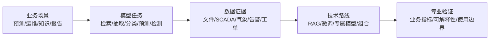
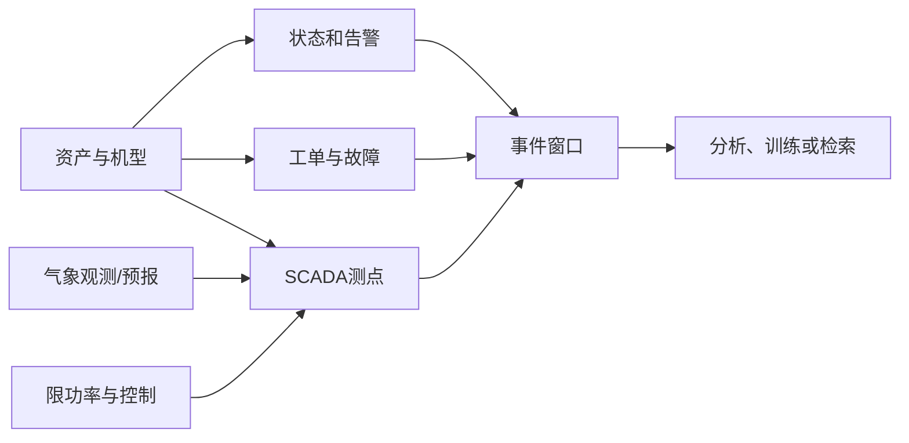
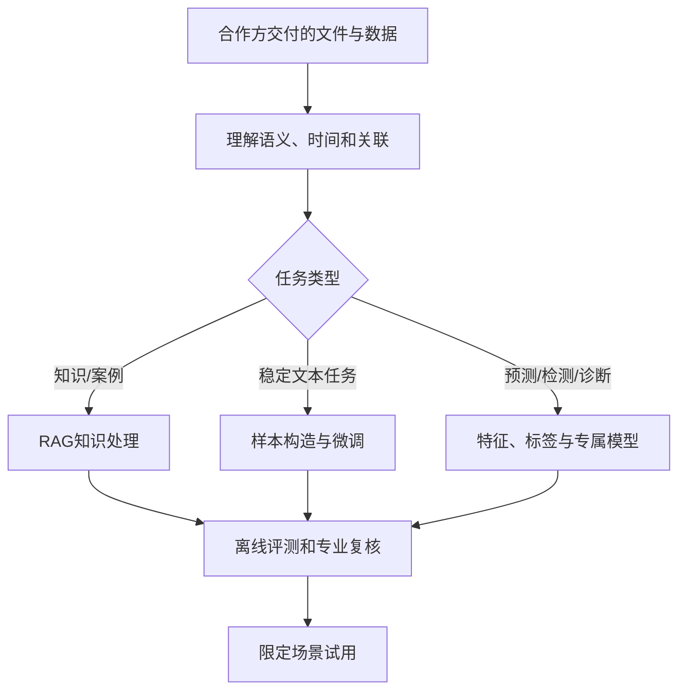

# 风电大模型项目入门

## 1. 文档定位

本文面向熟悉大模型或数据项目，但尚未参与过风电项目的产品、算法、研发和项目人员。

目标是帮助团队：

1. 听懂合作方描述的场站、机组、SCADA、告警、工单和功率预测等概念。
2. 把风电业务问题转换成检索、抽取、预测、异常检测或诊断任务。
3. 理解不同数据之间的关系，避免仅凭一张时序表就承诺模型效果。
4. 能够围绕真实场景与风电专业人员讨论数据需求和模型边界。

本文不是风资源评估、机组设计、并网控制或检修作业指导文件。具体专业定义以适用标准、设备技术文件和合作方业务体系为准。

---

## 2. 先从最终项目看风电知识

风电项目通常同时涉及自然资源、设备控制、场站运行和运维活动。模型任务只是其中一层。



同一个“故障分析”场景可能同时需要：

- 时序模型发现异常；
- 规则或统计方法合并告警；
- RAG 查找手册和历史案例；
- 大模型整理证据并生成报告草稿；
- 专业人员确认原因和处置。

因此，应先理解实际工作流程，再讨论模型类型。

---

## 3. 最小必要行业框架

### 3.1 风机和风电场怎样发电

风机把风的动能转换为机械能，再转换为电能。场站将多台机组的电能汇集并送入电网。


美国能源部提供了适合快速建立结构概念的 [How a Wind Turbine Works](https://www.energy.gov/cmei/wind/articles/how-wind-turbine-works) 和 [文字版工作原理](https://www.energy.gov/cmei/systems/how-wind-turbine-works-text-version)。

对数据项目最重要的几点是：

- 风速对可用风能影响很大，但实际功率还受控制策略、空气密度、尾流、设备状态和电网指令影响。
- 额定功率不是任意时刻的应发功率；低风、限功率、故障和检修都会使实际功率偏低。
- 不同机型、软件版本、传动路线和测点定义可能明显不同，不能简单合并建模。
- 海上与陆上项目在环境、设备、通信和运维条件上差异较大。

### 3.2 功率曲线是理解数据的入口

功率曲线描述特定条件下风速与功率的关系。可用下面的简图理解，不应把它当作所有机组的统一规则：


分析实际功率时通常还需要知道：

- 风速测在哪里、什么高度、采用何种平均方式；
- 机组是否处于正常发电状态；
- 是否限电、降载、停机或维护；
- 机舱风速是否受叶轮和机舱影响；
- 温度、气压等是否影响空气密度；
- 叶片污染、结冰、偏航误差和尾流是否存在；
- 理论功率曲线对应哪个机型和版本。

IEC 61400 系列是风能发电系统的重要标准体系。设计要求入口见 [IEC 61400-1](https://webstore.iec.ch/en/publication/26423)，功率性能测量入口见 [IEC 61400-12](https://webstore.iec.ch/en/publication/69211)。

### 3.3 需要认识的对象层级

```text
风电项目/风电场
├─ 场站公共系统
│  ├─ 集电线路
│  ├─ 升压站
│  └─ 气象与场站控制系统
└─ 风力发电机组
   ├─ 叶轮、变桨和偏航
   ├─ 主轴、轴承和齿轮箱（部分机型）
   ├─ 发电机、变流器和变压器
   ├─ 控制器与传感器
   └─ 测点、状态、告警和工单
```

常见概念：

| 概念        | 项目中的意义                                                 |
| ----------- | ------------------------------------------------------------ |
| 机组/风机   | 建模和运维的核心资产；需区分编号、机型、容量和配置           |
| SCADA       | 采集机组与场站运行数据的监控系统；不同系统的数据定义可能不同 |
| 测点/标签   | 风速、功率、转速、温度、电流、状态等变量及其标识             |
| 状态码      | 表示运行、待机、停机、限功率等状态；含义依厂家或场站体系而定 |
| 告警        | 控制系统产生的提示或事件；可能重复、级联或伴随停机           |
| 故障        | 需要结合现场检查、工单或分析确认的问题，不等同于任一告警     |
| 工单        | 检查、消缺、维修和更换等活动的记录                           |
| 功率预测    | 基于气象预报、历史数据和场站特征预测未来功率                 |
| 可利用率    | 反映设备可运行程度的指标，但具体定义和排除项可能不同         |
| 限电/限功率 | 由于电网调度、场站控制或其他约束未按可用风能发电             |

术语定义、状态码和指标口径必须以合作方及设备资料为准。

---

## 4. 风电数据全景

### 4.1 常见数据及用途

| 数据类别                   | 典型内容                                 | 主要用途                           | 单独使用时的局限                     |
| -------------------------- | ---------------------------------------- | ---------------------------------- | ------------------------------------ |
| 标准、手册和内部文件       | 标准、设备手册、故障手册、检修规程       | 知识问答、故障解释、步骤和依据检索 | 需要区分机型、版本和适用场站         |
| 资产基础信息               | 场站、机组、部件、型号、投运和改造信息   | 跨源关联、分组建模、结果解释       | 不能说明某时刻运行状态               |
| SCADA 时序数据             | 风速、功率、转速、桨距角、温度、电流等   | 功率分析、预测、异常检测、健康评估 | 测点含义和质量不明时易误判           |
| 状态与告警                 | 状态码、告警码、发生和恢复时间           | 正常样本筛选、事件识别、告警分析   | 告警可能级联，状态切换规则依系统而异 |
| 气象观测                   | 测风塔、气象站、激光雷达、机舱测风       | 风资源、功率分析、预测和偏差诊断   | 高度、位置、频率和设备差异明显       |
| 数值天气预报               | 不同提前量的风速、风向、温度、气压等     | 短期和超短期功率预测               | 预报发布时间、有效时间和版本必须对齐 |
| 限电与控制数据             | 有功设定、限功率指令、场站控制记录       | 识别非设备原因的功率损失           | 缺失时会把限电误判为性能下降         |
| 故障与工单                 | 现象、检查、原因、措施、更换件、恢复结果 | 标签构建、相似案例检索、维修辅助   | 文本记录和告警之间未必直接对应       |
| 叶片、振动、油液等专项监测 | 高频振动、状态监测、检测报告             | 部件专项诊断                       | 往往需要专门信号处理和专业标签       |
| 发电量及经营指标           | 日月电量、停机损失、可利用率等           | 经营分析、报表问答                 | 汇总指标不适合直接定位设备原因       |

### 4.2 一条可用的分析链路



例如“某台风机功率偏低”至少要区分：

- 来风条件是否相同；
- 是否受尾流或地形影响；
- 是否处于正常发电状态；
- 是否有变桨、偏航或温度异常；
- 是否收到限功率指令；
- 是否处于检修前后；
- 相同机型其他机组是否出现类似现象。

只有功率和风速两列数据，通常不足以给出可靠原因。

### 4.3 时间语义是风电数据的关键

不同数据源可能分别使用：

- 秒、分钟、10 分钟、小时或日级采样；
- 瞬时值、平均值、最大值、最小值或标准差；
- 告警开始时间、结束时间、确认时间；
- 工单创建、开工、完工和关闭时间；
- 气象预报发布时间与预报目标时间；
- 本地时间、北京时间或 UTC。

建模前必须弄清这些时间含义。尤其在功率预测中，任何在预测时刻之后才产生的信息都不能作为输入，否则离线效果会被数据泄漏夸大。

### 4.4 关键关联标识

项目中常依赖以下信息连接数据：

- 场站和机组编号；
- 设备或部件编码；
- 机型、控制器和软件版本；
- 测点名称及来源系统；
- 告警、故障和工单编号；
- 事件时间窗口；
- 气象网格位置、观测位置和高度；
- 文件编号、设备型号和版本。

项目团队应理解合作方现有标识，不要求合作方重新采用统一命名。

---

## 5. 场景到技术路线的判断

### 5.1 典型场景地图

| 场景                   | 更可能的技术路线                       | 关键数据                               |
| ---------------------- | -------------------------------------- | -------------------------------------- |
| 手册、规程和标准问答   | RAG                                    | 文件结构、版本、机型和引用位置         |
| 故障案例与维修经验检索 | RAG + 结构化过滤                       | 故障现象、部件、告警、原因、措施、结果 |
| 工单或报告要素抽取     | 提示词；稳定后可微调                   | 原文、目标字段、专家确认样本           |
| 告警归并和故障分类     | 规则/时序特征 + 分类模型；可结合大模型 | 告警序列、状态、SCADA、工单结论        |
| 功率预测               | 专属时序/机器学习模型                  | 历史功率、气象观测、NWP、状态和限电    |
| 功率曲线与性能分析     | 统计/机器学习模型                      | 风速、功率、空气密度、状态、控制和机型 |
| 异常检测与健康评估     | 专属模型                               | 连续 SCADA、工况、告警、检修和故障标签 |
| 运行或分析报告生成     | 模板/规则 + 模型结果 + RAG/大模型      | 结构化分析结果、引用资料和历史范例     |

### 5.2 RAG 适合什么

RAG 适合答案主要来自手册、规程、标准、故障案例和维修经验的场景。

风电 RAG 应特别注意：

- 文件适用于哪个机型、场站、部件和软件版本；
- 告警代码在不同厂家或控制器中是否同义；
- 表格、故障树、图片和附件是否包含关键内容；
- 同一部件的中文名、英文名、缩写和厂家名称；
- 检索结果能否引用到具体章节、页码和案例；
- 历史案例是相似参考还是已经证明适用于当前机组。

“检索到相似故障”不能直接等同于“诊断出当前故障”。RAG 可以提供候选依据，最终判断还需要实时数据、检查结果或专业人员确认。

### 5.3 微调适合什么

微调更适合稳定且有明确输出规范的文本任务，例如：

- 工单故障部件或原因分类；
- 维修记录要素抽取；
- 告警文本标准化；
- 按固定结构生成运行摘要；
- 将自然语言问题转换为检索条件。

训练样本需要说明：

- 类别或字段由谁定义；
- 标签是初步判断还是最终结论；
- 不同场站和人员的记录习惯是否一致；
- 是否覆盖不同机型、版本和少见故障；
- 输入中是否包含模型实际使用时拿不到的信息。

原始工单数量多不代表可以直接微调。重复记录、模板文字和结论可靠性都会影响样本价值。

### 5.4 专属模型适合什么

功率预测、性能分析、异常检测和设备健康评估通常需要专属模型。

#### 功率预测

需要共同确认：

- 预测对象是单机还是全场；
- 预测提前量和时间分辨率；
- 可用的气象观测与预报产品；
- 预测时刻实际能够取得的输入；
- 限电、停机和缺测如何处理；
- 评价指标及业务上更关注的时段。

#### 异常检测和故障预测

需要共同确认：

- 要发现的是测点异常、性能偏离还是部件故障；
- 正常工况如何筛选；
- 故障发生、发现和维修时间如何定义；
- 预警提前量多长才有业务价值；
- 同一故障是否有足够实例；
- 误报和漏报的业务成本；
- 模型输出后由谁采取什么动作。

专属模型的异常分数可以交给大模型解释，但大模型不应凭分数自行补出故障原因。

---

## 6. 与合作方交流时的工作逻辑

合作方熟悉风电专业和自身数据体系，不需要项目团队规定其内部交付流程。团队的职责是理解业务，并把需求表达成对方可以判断“有或没有、能否提供”的数据内容。

### 6.1 建议的推进框架


#### 第一步：理解现有工作流程

先确认：

- 谁在什么时间使用结果；
- 当前如何完成预测、分析、检修或知识查询；
- 当前最耗时、最依赖个人经验或最容易遗漏的环节；
- 输出会触发报告、复核、派工还是控制动作；
- 错误结果的实际影响。

#### 第二步：定义输入和输出

例如“故障诊断”需要继续拆解：

- 输入是实时 SCADA、历史窗口、告警序列、工单文本还是组合；
- 输出是异常评分、故障类别、相似案例、原因候选还是维修建议草稿；
- 需要多早给出结果；
- 输出按机组、部件还是事件组织；
- 是否必须提供测点趋势和文件依据；
- 专业人员如何复核。

#### 第三步：还原专业判断链

请合作方用典型案例说明：

- 首先看哪些数据；
- 如何排除限电、停机、测点故障和环境影响；
- 哪些告警是原因，哪些是连锁结果；
- 如何从现象定位到部件；
- 最终原因记录在哪里；
- 维修后如何确认问题解决。

这条判断链决定模型需要哪些数据，也决定评测应验证什么。

#### 第四步：走查少量真实样例

建议至少覆盖：

- 一次典型正常情况；
- 一次明确异常或故障；
- 一次易误判情况，例如限电、传感器异常或维护状态；
- 一次信息不足、无法得出结论的情况。

样例走查用于验证理解，不要求合作方提前清洗或改造数据。

#### 第五步：形成数据需求

数据需求应围绕任务表达：

- 需要哪些数据类别；
- 覆盖哪些场站、机型、设备、时间和业务情况；
- 数据之间需要通过什么现有标识或时间关系连接；
- 哪些测点、状态、指标和标签需要专业解释；
- 哪些资料用于知识检索，哪些数据可能用于模型训练；
- 是否需要保留原始文件、表格、图片和附件。

文件格式和内部处理方法可在实际交付后再确定。

### 6.2 交流中应深入确认的问题

#### 关于资产和版本

- 同一场站有哪些机型和容量？
- 软件升级、部件更换和技术改造如何记录？
- 相同测点名在不同机型中含义、单位和频率是否一致？
- 训练结果预期推广到哪些场站或机型？

#### 关于状态和控制

- 正常运行、待机、停机、检修和限功率如何识别？
- 状态码是否互斥，状态切换是否有滞后？
- 是否保存功率设定值、限电指令和控制模式？
- 结冰、高温、高风等特殊控制是否可识别？

#### 关于时间序列

- 采样数据是瞬时值还是统计值？
- 缺失、重复、插值和质量标志如何体现？
- 不同系统的时间是否同步？
- 测点量程、单位和校准变化是否有记录？

#### 关于告警、故障和工单

- 告警发生与恢复时间如何定义？
- 多条告警如何归并为一次事件？
- 故障原因是推测、检查结论还是维修验证后的结论？
- 工单能否关联到机组、部件、告警和时间窗口？
- 更换部件但未找到根因的记录如何理解？

#### 关于功率预测

- 使用哪一版气象预报，发布时间和有效时间如何表达？
- 历史训练中能否还原当时实际可获得的预报？
- 限电和故障时段是预测目标的一部分还是需要排除？
- 业务使用哪种误差指标，是否关注爬坡或极端天气？

#### 关于模型边界

- 模型是提供提示、排序还是自动生成结论？
- 哪类结果必须人工复核？
- 错误告警和漏掉故障哪一个代价更高？
- 模型是否会接入实时系统，还是只做离线分析？

---

## 7. 后续收到数据后怎样落到模型工作



收到真实数据后再决定：

- 文档如何解析和切分；
- 表格、图片和附件如何保留；
- 不同 SCADA 表如何时间对齐；
- 状态、告警和工单如何关联；
- 哪些时段可作为正常样本；
- 标签如何确认；
- 不同机型能否共同训练；
- 如何划分训练和测试数据。

数据处理所需的内部说明和中间结果可以在实施时自动或半自动形成，不要求合作方预先遵循一套复杂规范。

---

## 8. 风电模型项目的高频风险

### 8.1 忽略状态和限电

把停机、待机或限功率数据当作正常发电，会严重影响功率曲线、异常检测和故障分析。

### 8.2 混合不同机型和版本

不同机型的控制逻辑、测点和故障模式不同。即使字段名相同，也需要验证语义和分布。

### 8.3 时间泄漏

使用事后生成的工单结论、更新后的气象产品或未来窗口数据训练预测模型，会得到无法在线复现的效果。

### 8.4 把告警当作根因

一个根因可能触发多条级联告警；一条告警也可能只是状态变化。根因标签应结合检查和维修结果确认。

### 8.5 只看总体平均指标

总体误差可能掩盖高风速、爬坡、极端天气或少见故障上的失败。评测要与业务真正关心的情况对应。

### 8.6 把异常检测表述为故障诊断

异常只说明偏离已学习的模式，可能来自环境、控制、数据质量或设备变化。模型输出名称和使用方式必须准确。

### 8.7 过早限定数据格式

合作方的 SCADA、告警和工单往往来自不同系统。先理解语义和关联，再设计内部处理方式，比要求统一模板更实际。

---

## 9. 建议的内部学习顺序

### 第一轮：能参与场景讨论

1. 阅读本文第 2、3、5、6 节。
2. 浏览 [风电术语表](./wind-glossary.md)。
3. 通过 DOE 材料理解风机结构和功率控制。
4. 浏览 IEC 61400 入口，了解行业标准覆盖范围。

### 第二轮：围绕确定场景学习

- 知识问答：学习机型、部件、文件版本和故障代码体系。
- 功率预测：学习气象预报时间语义、场站控制和预测指标。
- 性能分析：学习功率曲线、状态筛选、空气密度、尾流和限功率。
- 故障与运维：学习部件结构、告警链、工单流程和确认标签。

### 第三轮：用合作方样例校准

公开资料只能提供通用框架。具体机型、测点、状态码、控制策略和业务判断逻辑，应以合作方材料和专业人员解释为准。

---

## 10. 权威资料入口

### 风机原理与行业基础

- [美国能源部：How a Wind Turbine Works](https://www.energy.gov/cmei/wind/articles/how-wind-turbine-works)
- [美国能源部：How a Wind Turbine Works — Text Version](https://www.energy.gov/cmei/systems/how-wind-turbine-works-text-version)
- [美国能源部：Wind Energy FAQ](https://www.energy.gov/cmei/systems/frequently-asked-questions-about-wind-energy)
- [美国能源部：Advanced Wind Turbine Drivetrain Trends](https://www.energy.gov/cmei/wind/articles/advanced-wind-turbine-drivetrain-trends-and-opportunities)

### 标准入口

- [IEC 61400-1：Wind energy generation systems — Design requirements](https://webstore.iec.ch/en/publication/26423)
- [IEC 61400-12 系列入口](https://webstore.iec.ch/en/publication/69211)
- [国家标准全文公开系统](https://std.samr.gov.cn/)

### 气象和公开研究数据

- [中国气象数据网](https://data.cma.cn/)
- [Copernicus Climate Data Store：ERA5](https://cds.climate.copernicus.eu/datasets/reanalysis-era5-single-levels?tab=overview)
- [Global Wind Atlas](https://globalwindatlas.info/)
- [NREL WIND Toolkit](https://www.nrel.gov/grid/wind-toolkit)

### 运行数据研究参考

- [NREL：Wind Plant SCADA Data Analysis（PDF）](https://www.nrel.gov/docs/fy22osti/81428.pdf)
- [国家能源局](https://www.nea.gov.cn/)

> 公开数据可用于理解方法和原型验证，但不能自动代表合作方具体场站、机型和运行条件。标准全文还应遵守相应版权和许可要求。
